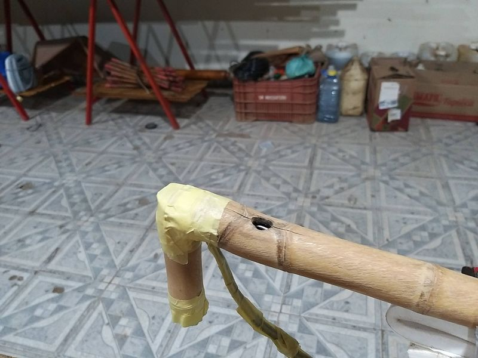
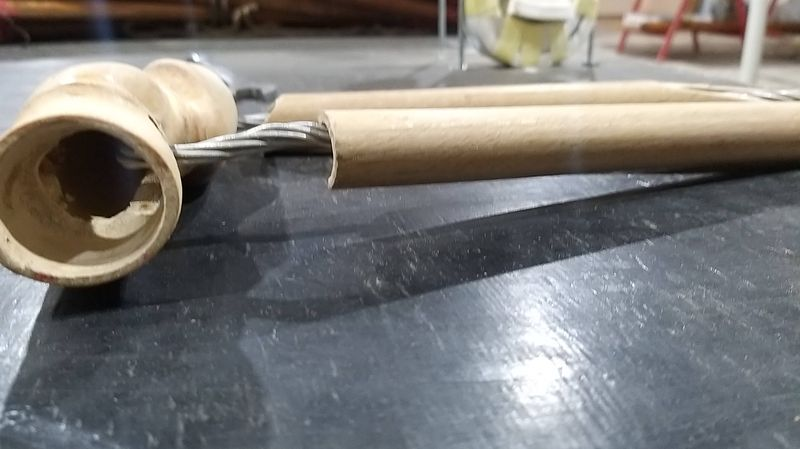
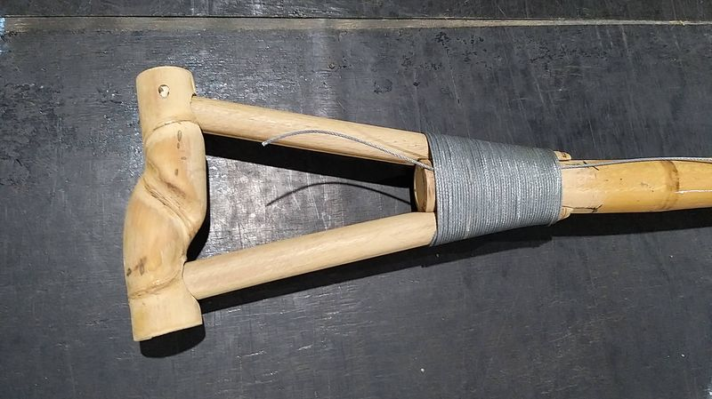
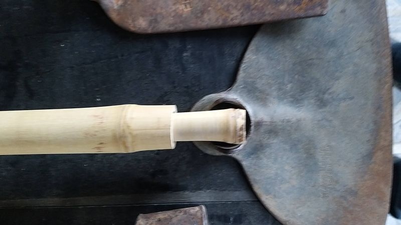
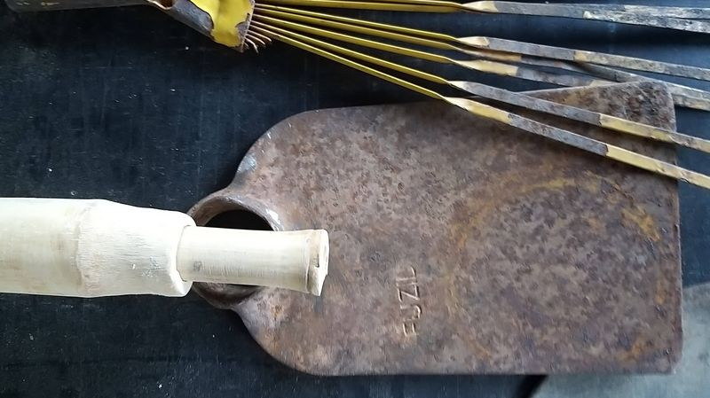
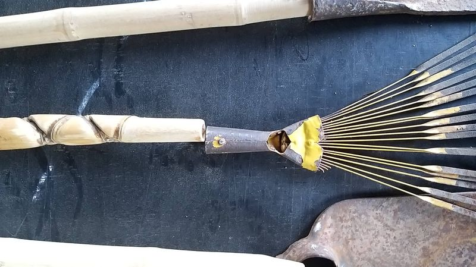

## Memorial Descritivo Técnico

**Título:** Sistema Modular Sustentável de Reforço Estrutural e Blindagem para Cabos e Estruturas em Bambu com PU Vegetal
**Idealização:** Fábio Takwara

### 1. Introdução

Este memorial apresenta um método inovador para reforço, proteção e modularidade de cabos e estruturas de bambu, aplicado especialmente a ferramentas agrícolas e utilidades rurais, mas replicável em contextos de arquitetura, construção leve e mobiliário ecoeficiente. A solução une tradição (uso do bambu), materiais renováveis, tecnologia nacional e mentalidade maker e circular, com rigor nos critérios normativos.

### 2. Fundamentação e Contexto

A crescente demanda por materiais de baixo carbono impulsiona alternativas à madeira e ao aço. O bambu, além de ser rapidamente renovável, possui excelente relação resistência-peso e apelo socioambiental. Sua limitação estrutural (oco, sensível à umidade e ataques biológicos) é superada pelo sistema integrado de reforço com fio de aço galvanizado e preenchimento com poliuretano vegetal expansivo (MAMONEX RD70), seguido da blindagem total com impermeabilizante vegetal (UG132A). Isto garante:

- **Aprimoramento da resistência mecânica, durabilidade e ergonomia**;
- **Modularidade** (fácil substituição/manutenção de partes);
- **Circularidade** e baixo impacto ambiental em todas as etapas do ciclo de vida.

  <h4 class="carousel-title">Cabos para Ferramentas Agrícolas e outros</h4>
  

    

      <ul class="splide__list">
        <li class="splide__slide">
          
        </li>
        <li class="splide__slide">
          
        </li>
        <li class="splide__slide">
          
        </li>
        <li class="splide__slide">
          
        </li>
        <li class="splide__slide">
          
        </li>
        <li class="splide__slide">
          
        </li>
        <li class="splide__slide">
          
        </li>
        <li class="splide__slide">
          
        </li>
        <li class="splide__slide">
          
        </li>
        <li class="splide__slide">
          
        </li>
        <li class="splide__slide">
          
        </li>
        <li class="splide__slide">
          
        </li>
        <li class="splide__slide">
          
        </li>
        <li class="splide__slide">
          
        </li>
        <li class="splide__slide">
          
        </li>
        <li class="splide__slide">
          
        </li>
        <li class="splide__slide">
          
        </li>
        <li class="splide__slide">
          
        </li>
        <li class="splide__slide">
          
        </li>
        <li class="splide__slide">
          
        </li>
        <li class="splide__slide">
          
        </li>
        <li class="splide__slide">
          
        </li>
        <li class="splide__slide">
          
        </li>
        <li class="splide__slide">
          
        </li>
        <li class="splide__slide">
          
        </li>
      </ul>
    

  

### 3. Materiais e Propriedades Técnicas

- **Bambu tratado:**
    - Preferencialmente do gênero *Phyllostachys* (Áurea, Edulis), dimensionados, secos e tratados conforme ISO 22156/22157 e ABNT NBR 16828-1/2.
- **Fio de aço galvanizado:**
    - Usado como armadura interna longitudinal e travamento estrutural, aportando redundância mecânica à peça.
- **PU Vegetal Expansivo (MAMONEX® RD70):**
    - **Origem:** Óleo de mamona, bicomponente, ecologicamente correto.
    - **Peso específico (expansão livre):** 70 kg/m³
    - **Resistência à compressão (10%):** 0,25 MPa
    - **Resistência à tração direta:** 0,12 MPa
    - **Absorção de água 48h:** 0,01% em volume
    - **Condutividade térmica:** 0,0452 W/mK
    - **Capilaridade:** Inexistente
    - **Combustibilidade:** Não propaga chama
    - **Biodegradabilidade:** Total, livre de CFC
- **PU Vegetal Impermeabilizante (IMPERVEG® UG132A):**
    - **Origem:** Bi-componente, 100% sólido, base óleo de mamona.
    - **Tensão de ruptura à tração:** 2 MPa
    - **Módulo de deformação:** 10 MPa
    - **Alongamento (ruptura):** ~25%
    - **Resist. química/física:** Intempéries, UV, ácidos, bases, sais.
    - **Isento de solventes/subprodutos tóxicos**; uso seguro (PORTARIA MS 518).
    - **Rendimento:** 0,7–1 kg/m² (3 a 5 demãos)
- **Elementos adicionais de fixação/acabamento:**
    - Definidos conforme desenho, uso e demanda da peça.

### 4. Procedimento Técnico

1. **Preparação dos colmos:**
Corte, seleção, secagem e eventual usinagem segundo a aplicação (cabo tipo “T”, braços longitudinais, encaixes).
2. **Montagem estrutural e reforço:**
Passagem do fio de aço galvanizado pelo interior dos colmos, tensionando conforme projeto, com extremidades preparadas para travamento mecânico.
3. **Injeção do PU expansivo:**
Mistura e aplicação do MAMONEX RD70 nos colmos e sobre o fio de aço, preenchendo folgas, garantindo travamento e distribuição homogênea de esforços.
4. **Cura, montagem final e blindagem:**
Ajustes finais após expansão/cura parcial do PU. Aplicação do impermeabilizante UG132A em todas as superfícies, conferindo proteção absoluta contra umidade, fungos e agentes químicos.
5. **Acabamento e validação:**
Pós-cura, lixamento, possíveis demãos extras de PU e inspeção final. Os protótipos são submetidos a testes mecânicos manuais e laboratoriais (tração, compressão, flexão e fadiga).

### 5. Inovação, Sustentabilidade e Estilo (perfil do criador)

- **Inovação:** Estrutura híbrida, integrando forças do bambu e do aço com polímeros vegetais—resistência elevada à tração, torção, impacto, modularidade e blindagem total.
- **Sustentabilidade:** Todos os insumos principais derivam de fontes renováveis e/ou recicláveis, com biodegradabilidade comprovada, ausência de solventes, CFC ou produtos nocivos.
- **Cultura maker/prática:** Processo replicável artesanalmente, adaptável a diferentes espécies de bambu e necessidades regionais, sendo promovido no estilo prático, inspirador e acessível típico de Fábio Takwara.
- **Inclusão social:** Baixo custo, potencial para inclusão produtiva em comunidades e cooperativas.

### 6. Aplicações Práticas e Resultados Esperados

- **Cabos agrícolas e ferramentas manuais:**
Aumento significativo da vida útil, resistência ampliada, menor absorção de umidade e perda de desempenho.
- **Estruturas modulares e móveis:**
Facilidade de desmontagem, manutenção e reciclagem.
- **Utilidades rurais sustentáveis:**
Componentes estruturais leves, com alta performance ambiental e mecânica, viabilizando uso em construções, peças de mobiliário e sistemas outdoor.
- **Resultados esperados:**
Vida útil ampliada (>10–20 anos), manutenção mínima, resistência à biodegradação e ataques biológicos, estabilidade dimensional, proteção integral contra água e agentes externos, segurança para usos próximos a elétrica/água.

### 7. Referências Normativas e Certificações

- **ISO 22156:2021:** Projeto estrutural de bambu
- **ISO 22157:2019:** Propriedades físicas/mecânicas
- **ABNT NBR 16828-1/2:** Estruturas de bambu
- **NBR 9575/2003:** Seleção/projeto em impermeabilização
- **PORTARIA MS 518:** Potabilidade da água
- **AWPA/ASTM D1413:** Ensaios de durabilidade e biodegradação (referencial comparativo)

**Recomendações:** Submissão dos protótipos a ensaios laboratoriais normatizados (tração, compressão, fadiga), análise de resistência e segurança alimentar/contato, e obtenção formal de certificações setoriais.

### 8. Considerações Finais

Este memorial, alinhado à filosofia inovadora, social e ecológica de Fábio Takwara, dissemina uma solução replicável, ecoeficiente e segura, estimulando práticas regenerativas, inclusão produtiva e a transição efetiva para tecnologias de baixo carbono nas comunidades e cadeias produtivas. O sistema proposto representa uma alternativa concreta e avançada para o futuro dos cabos e conectores em bambu na agricultura, construção e design sustentável.

======

# Leitura adicional

# Métodos de Preservação e Durabilidade para Cabos de Ferramentas Agrícolas: Análise Comparativa entre Bambu e Madeira Baseada em Normas Técnicas Internacionais

  

Esta análise comparativa examina os métodos de preservação e características de durabilidade para cabos de ferramentas agrícolas fabricados em bambu versus madeira, fundamentada em normas técnicas internacionais como ISO, ASTM e AWPA. A pesquisa revela diferenças significativas entre os materiais, com **o bambu apresentando vantagens em sustentabilidade e propriedades mecânicas específicas, enquanto a madeira demonstra maior longevidade com tratamentos preservativos adequados**. As normas técnicas internacionais oferecem diretrizes consolidadas para ambos os materiais, sendo as normas ISO 22157:2019 e ISO 22156:2021 específicas para bambu, e ASTM D1413, ASTM D2017 e padrões AWPA para madeira.[^1][^2][^3][^4][^5][^6]

  

## Contextualização dos Materiais e Normas Técnicas

  

### Bambu como Material Estrutural

  

O bambu emerge como uma alternativa sustentável promissora para cabos de ferramentas agrícolas, sendo regulamentado por normas técnicas específicas como a ISO 22157:2019 (Determinação de propriedades físicas e mecânicas) e ISO 22156:2021 (Projeto estrutural). No Brasil, a norma ABNT NBR 16828-1/2 estabelece requisitos básicos para estruturas de bambu, abordando propriedades físicas, mecânicas e durabilidade. A estrutura celular única do bambu, composta por fibras longitudinais em matriz de parênquima, confere ao material **resistência à tração superior ao aço em algumas espécies, variando de 130 MPa a 370 MPa**. Esta característica resulta da orientação das fibras ao longo do eixo de crescimento do colmo, conferindo propriedades mecânicas excepcionais para aplicações estruturais.[^7][^8][^3][^4][^9]

  

A vida útil do bambu sem tratamento preservativo varia de **1 a 3 anos quando em contato com solo e condições externas, e de 4 a 6 anos em locais cobertos sem contato direto com solo**. Esta limitação temporal decorre principalmente da alta concentração de amido nos colmos, que atrai organismos xilófagos, especialmente o besouro Dinoderus minutus. Entretanto, com tratamento preservativo adequado, a durabilidade pode ser estendida significativamente para **5 a 20 anos**, dependendo do método de tratamento aplicado e das condições de uso.[^10][^11][^8]

  

### Madeira Tradicional e Regulamentação

  

A madeira para cabos de ferramentas agrícolas é regulamentada por um conjunto robusto de normas internacionais, incluindo as normas ASTM D1413 (métodos de teste para preservativos), ASTM D2017 (teste acelerado de resistência natural ao apodrecimento), e os padrões da American Wood Protection Association (AWPA). A AWPA estabelece o sistema de categorias de uso (Use Category System), que define cinco categorias de risco de biodeterioração para produtos de madeira tratada, facilitando a seleção do tratamento apropriado para cada aplicação específica.[^1][^2][^12][^13][^5][^6][^14][^15]

  

As espécies de madeira comumente utilizadas para cabos de ferramentas incluem eucalipto, ipê, freijó, marfim e tauari, cada uma com características específicas de resistência e durabilidade. A madeira não tratada apresenta vida útil de **2 a 5 anos para espécies comuns**, enquanto com tratamento preservativo adequado pode alcançar **10 a 30 anos, dependendo da espécie e método de tratamento aplicado**. A norma ISO 21887:2007 define cinco classes de uso que representam diferentes situações de serviço às quais madeira e produtos à base de madeira podem ser expostos.[^2][^16][^17]

  

## Métodos de Preservação e Tratamentos

  

### Tratamentos Preservativos para Bambu

  

Os métodos de preservação do bambu dividem-se em **tratamentos tradicionais (naturais) e tratamentos químicos**. Os tratamentos tradicionais incluem cura no bambuzal, cura natural por 7-10 dias na posição vertical para escorrer a seiva, imersão em água, tratamento pelo fogo e tratamento pela fumaça. Estes métodos, embora menos eficazes que os químicos, representam opções de baixo custo para pequenos produtores.[^10][^11][^8][^9]

  

O **método de difusão vertical por imersão (VSD)** representa uma técnica econômica e eficaz para tratamento do bambu. O processo envolve perfuração dos nós internos (exceto o último), posicionamento vertical dos colmos e preenchimento com solução preservativa por capilaridade. Este método permite penetração adequada do preservativo através da estrutura do bambu, criando proteção contra agentes biodeterioradores.[^18][^11]

  

Os tratamentos químicos mais eficazes utilizam **preservativos hidrossolúveis, especialmente CCB (borato de cobre cromatado) em concentração de 1%**, preparado com sulfato de cobre, dicromato de sódio e ácido bórico. O ácido bórico com bórax é considerado o mais eficaz por provocar menor agressão ao meio ambiente. A substituição de seiva e imersão prolongada são métodos químicos recomendados, seguindo princípios similares aos utilizados para madeira.[^11][^8]

  

### Sistemas de Preservação para Madeira

  

A preservação da madeira emprega **dois sistemas principais: processos industriais com pressão (autoclave) e processos sem pressão (caseiros)**. Os processos industriais utilizam autoclaves com aplicação de vácuo e pressão, subdividindo-se em **processo de célula cheia (com vácuo inicial) e célula vazia (sem vácuo inicial)**. O método Bethell, desenvolvido em 1838, permanece como padrão para tratamento industrial, consistindo em vácuo inicial, admissão do preservativo, pressão de impregnação e vácuo final.[^19][^20][^2]

  

Os **preservativos mais utilizados no Brasil incluem CCA (arseniato de cobre cromatado) tipo C, CCB (borato de cobre cromatado) e creosoto**. O CCA representa 90% dos tratamentos industriais brasileiros, enquanto CCB constitui os 10% restantes. As concentrações típicas variam de **1% a 3% dependendo da categoria de uso**, definidas pela norma NBR 7190 que estabelece seis categorias de uso para madeira em serviço.[^2][^21]

  

Métodos sem pressão incluem **imersão prolongada, difusão, substituição de seiva, método de Boucherie, e banho quente/frio**. O tratamento por substituição de seiva é amplamente utilizado em propriedades rurais para moirões e peças de menor diâmetro, sendo considerado eficiente e de baixo custo. O processo de banho quente/frio, que utiliza choque térmico para forçar penetração do preservativo, representa alternativa de custo moderado para tratamentos não industriais.[^22][^20][^19][^2]

  

## Análise Comparativa de Durabilidade e Propriedades

  

  

Comparação de Aspectos de Durabilidade e Preservação: Bambu vs Madeira para Cabos de Ferramentas Agrícolas

  

### Propriedades Mecânicas Comparativas

  

As propriedades mecânicas revelam vantagens distintas para cada material. O bambu apresenta **resistência à tração paralela às fibras variando de 40 MPa a 370 MPa, com média em torno de 130-250 MPa**, superando significativamente a madeira comum que varia de **50 MPa a 150 MPa**. Esta superioridade resulta da estrutura fibrosa longitudinal do bambu, onde as fibras de celulose proporcionam alta resistência à tração e flexão.[^23][^4]

  

A **resistência à compressão paralela às fibras do bambu varia de 20 MPa a 120 MPa**, sendo aproximadamente 30% inferior à sua resistência à tração. Esta característica influencia-se pela heterogeneidade do colmo, onde a camada externa rica em fibras apresenta maior resistência comparada à camada interna com mais tecidos parenquimatosos. Para madeira, a resistência à compressão típica situa-se entre **30 MPa e 80 MPa**, variando conforme a espécie e densidade.[^4]

  

A **densidade do bambu (350-800 kg/m³) é geralmente inferior à da madeira (400-1200 kg/m³)**, resultando em excelente relação resistência-peso. Esta característica torna o bambu especialmente atrativo para cabos de ferramentas, onde o peso reduzido melhora a ergonomia sem comprometer a resistência estrutural.[^24][^16][^4]

  

### Durabilidade Natural e Tratada

  

A durabilidade representa aspecto crítico na seleção do material. **Sem tratamento, o bambu apresenta vida útil limitada de 1-3 anos em condições adversas**, principalmente devido ao alto teor de amido que atrai organismos xilófagos. A madeira não tratada oferece **durabilidade ligeiramente superior de 2-5 anos para espécies comuns**, variando significativamente entre espécies.[^10][^11][^2][^16]

  

Com tratamento preservativo adequado, a **madeira alcança vida útil de 10-30 anos**, estabelecendo vantagem significativa sobre o bambu tratado que atinge **5-20 anos**. Esta diferença relaciona-se à estrutura celular: a madeira permite melhor penetração e retenção de preservativos, especialmente no alburno, enquanto o bambu requer técnicas específicas como perfuração dos nós para penetração adequada.[^18][^11][^2][^16][^10]

  

A **resistência à umidade varia entre os materiais**: o bambu apresenta resistência moderada, superior à madeira comum devido à camada externa rica em sílica e cera que protege contra retenção de umidade. Entretanto, madeiras adequadamente tratadas com preservativos hidrossolúveis desenvolvem excelente resistência à umidade e biodeterioração.[^8][^25][^2]

  

## Normas Técnicas Internacionais Aplicáveis

  

### Regulamentação Internacional para Bambu

  

As normas ISO constituem a base regulatória internacional para bambu estrutural. A **ISO 22157:2019 especifica métodos para determinação de propriedades físicas e mecânicas**, incluindo ensaios de flexão, compressão, tração e cisalhamento. A norma define procedimentos padronizados para preparação de corpos de prova, execução de ensaios e interpretação de resultados, garantindo comparabilidade entre diferentes pesquisadores e aplicações.[^3][^26][^27][^4]

  

A **ISO 22156:2021 estabelece diretrizes para projeto estrutural de bambu**, abordando requisitos de segurança, servicibilidade e durabilidade. Esta norma serve como referência internacional para adaptação de normas nacionais, como a brasileira ABNT NBR 16828-1/2. A principal diferença entre ISO 22157 e NBR 16828-2 reside nos detalhes de execução e especificações dimensionais, com a ISO oferecendo escopo mais abrangente enquanto a NBR adapta-se às condições brasileiras.[^7][^8][^27][^4]

  

Países como **Índia (Indian Standard 6874 de 1973), Colômbia (NSR-10), Peru (Norma NTE E.100) e Equador (NEC - Estruturas de Guadúa) desenvolveram normas nacionais baseadas nas diretrizes ISO**. Estas normas abordam sistemas estruturais específicos e considerações locais como resistência a terremotos e ventos.[^8]

  

### Padrões Internacionais para Madeira

  

A regulamentação internacional para preservação de madeira baseia-se em **sistema robusto de normas ASTM, AWPA e ISO**. A ASTM D1413 estabelece métodos de teste para preservativos de madeira por culturas de bloco de solo em laboratório, enquanto a ASTM D2017 especifica métodos de teste acelerado para resistência natural ao apodrecimento.[^1][^2][^28][^12][^13][^5][^6]

  

A **American Wood Protection Association (AWPA) representa a organização principal de padronização baseada em consenso** para proteção de madeira nos Estados Unidos, com influência internacional significativa. O padrão AWPA U1 constitui a norma primária para produtos de madeira tratada com preservativos, contendo especificações gerais e requisitos específicos para diferentes tipos de produtos.[^5][^6][^14][^15]

  

O **Sistema de Categorias de Uso (Use Category System) da AWPA define cinco categorias de risco de biodeterioração** para produtos de madeira tratada. Este sistema simplifica a seleção do tratamento apropriado baseado nas condições de serviço esperadas, desde uso interior sem contato com solo (UC1) até uso marinho com exposição a moluscos e crustáceos (UC5).[^14][^15]

  

A **norma ISO 21887:2007 define cinco classes de uso representando diferentes situações de serviço** para madeira e produtos à base de madeira mundialmente. Esta norma aplica-se apenas a preservativos e processos para pré-tratamento, não abrangendo produtos para remediação de danos existentes.[^17]

  

## Sustentabilidade e Considerações Ambientais

  

### Impacto Ambiental e Renovabilidade

  

O bambu apresenta **vantagens ambientais significativas sobre a madeira tradicional**, destacando-se como material de crescimento mais rápido do mundo. O ciclo de crescimento do bambu permite **colheita em 3-5 anos sem morte da planta**, contrastando com espécies de madeira que requerem 15-25 anos para eucalipto e 50+ anos para madeiras nobres. Esta característica confere ao bambu taxa de renovabilidade superior, reduzindo pressão sobre florestas nativas.[^7][^24][^16][^29]

  

O bambu funciona como **excelente sequestrador de carbono**, armazenando carbono tanto na biomassa quanto no solo através do sistema de rizomas. A transformação dos colmos em produtos duráveis garante que o carbono permaneça bloqueado durante toda a vida útil do objeto. Adicionalmente, o sistema de rizomas sobrevive à colheita individual de colmos, mantendo o ecossistema produtivo enquanto continua armazenando carbono.[^29]

  

A **deposição natural de folhas, ramos e bainhas do bambu atua como fonte importante de reciclagem de nutrientes**, especialmente sílica, e fornece cobertura morta que protege o solo contra erosão mantendo sua umidade. Este ciclo natural contribui para regeneração ambiental e recuperação de áreas degradadas.[^29]

  

### Tratamentos Preservativos e Segurança Ambiental

  

Os **preservativos utilizados em bambu, especialmente ácido bórico com bórax, apresentam menor agressão ao meio ambiente** comparados aos preservativos para madeira. A concentração típica de 1% para CCB em bambu é inferior às concentrações utilizadas em madeira (1-3%), reduzindo impacto ambiental potencial.[^11][^8][^2][^21]

  

Para madeira, o **CCA (arseniato de cobre cromatado) representa 90% dos tratamentos brasileiros**, mas possui restrições em alguns países devido à presença de arsênio. As regulamentações brasileiras do IBAMA exigem registro de todas as indústrias fabricantes, usinas de preservação e produtos preservativos. **Madeira tratada com CCA não deve ser utilizada em contato com alimentos humanos ou animais, água potável, ou em situações onde possa contaminar mel**.[^30][^2][^21]

  

O **desenvolvimento de preservativos de baixo impacto ambiental** constitui tendência atual, incluindo substâncias naturais e sintéticas ambientalmente responsáveis. Pesquisas avaliam produtos alternativos que mantenham eficácia preservativa reduzindo riscos ambientais e à saúde humana.[^12]

  

## Aplicações Específicas em Ferramentas Agrícolas

  

### Seleção de Material por Tipo de Ferramenta

  

A escolha entre bambu e madeira para cabos de ferramentas agrícolas deve considerar **requisitos específicos de cada implemento**. Para ferramentas que exigem alta resistência a impactos, como martelos e marretas, madeiras densas como ipê (extremamente duro e durável) ou marfim (alta densidade com ótima resistência a impactos) são preferíveis. O eucalipto, sendo leve e resistente, oferece opção econômica para ferramentas manuais de uso geral.[^16]

  

O bambu, com sua **excelente relação resistência-peso e propriedades de absorção de vibração**, adapta-se bem para cabos de enxadas, foices e ferramentas de manejo onde ergonomia e redução de fadiga são prioritárias. A estrutura fibrosa longitudinal do bambu proporciona flexibilidade controlada que reduz transmissão de choques para as mãos do usuário.[^31][^24][^16]

  

**Ferramentas elétricas ou que operam próximo a instalações elétricas beneficiam-se das propriedades isolantes naturais tanto do bambu quanto da madeira**, que não conduzem eletricidade como cabos metálicos. Esta característica de segurança representa vantagem importante em ambientes agrícolas onde ferramentas podem entrar em contato com instalações elétricas.[^16]

  

### Manutenção e Cuidados Operacionais

  

A **manutenção adequada é crucial para maximizar a vida útil de cabos em ambos os materiais**. Para cabos de madeira, recomenda-se evitar contato prolongado com umidade, limpeza regular com pano seco ou levemente umedecido, e aplicação periódica de óleo vegetal ou cera para conservar o material. **Verificação periódica para identificar rachaduras ou lascas é essencial para prevenir acidentes**.[^16]

  

Cabos de bambu requerem **cuidados similares, com atenção especial à lubrificação regular para evitar ressecamento e rachaduras**. Embora o bambu resista melhor à umidade que madeira comum, ainda necessita proteção contra exposição excessiva à água. **Armazenamento em local seco e arejado prolonga significativamente a vida útil de ambos os materiais**.[^25][^32][^16]

  

A **facilidade de substituição representa vantagem do bambu**, considerando seu menor custo e maior disponibilidade. Entretanto, a maior durabilidade da madeira tratada pode justificar investimento inicial superior em ferramentas de uso intensivo profissional.[^24][^25][^16]

  

## Conclusões e Recomendações Técnicas

  

A análise comparativa revela que **bambu e madeira apresentam características complementares para cabos de ferramentas agrícolas**, com vantagens específicas dependendo da aplicação. O bambu demonstra **superioridade em sustentabilidade, propriedades mecânicas específicas (resistência à tração) e relação resistência-peso**, enquanto a madeira oferece **maior durabilidade com tratamentos preservativos e penetração superior de preservativos**.[^10][^25][^2][^4][^16]

  

**Para aplicações onde sustentabilidade e redução de peso são prioritárias**, o bambu representa escolha superior, especialmente considerando seu ciclo de renovação de 3-5 anos versus 15-50 anos para madeira. **Para aplicações que demandam máxima durabilidade e uso intensivo profissional**, madeira adequadamente tratada oferece vida útil superior de 10-30 anos comparada aos 5-20 anos do bambu tratado.[^2][^24][^16][^29][^10]

  

As **normas técnicas internacionais oferecem base sólida para ambos os materiais**: ISO 22157:2019 e ISO 22156:2021 para bambu, e ASTM D1413, ASTM D2017 e padrões AWPA para madeira. A aplicação adequada dessas normas garante tratamentos preservativos eficazes e produtos seguros para uso agrícola.[^8][^1][^3][^4][^5][^6][^21][^2]

  

**Recomenda-se desenvolvimento de normas técnicas específicas para cabos de ferramentas agrícolas** que considerem requisitos únicos dessa aplicação, incluindo resistência a impactos, ergonomia e exposição a condições ambientais variáveis. A **integração de critérios de sustentabilidade nas especificações técnicas** pode favorecer adoção crescente de bambu em aplicações apropriadas, contribuindo para redução da pressão sobre florestas nativas.[^7][^29]

[^33][^34][^35][^36][^37][^38][^39][^40][^41][^42][^43][^44][^45][^46][^47][^48][^49][^50]

  

⁂

  

[^1]: https://periodicos.ufpel.edu.br/index.php/cienciadamadeira/article/view/4062/3206

  

[^2]: https://www.scielo.br/j/cflo/a/WSsH9ktwmQyc3k4Prt36Q3H/

  

[^3]: https://translate.google.com/translate?u=https%3A%2F%2Fbambooimport.com%2Fen%2Fpages%2Fthe-mechanical-properties-of-bamboo\&hl=pt\&sl=en\&tl=pt\&client=srp

  

[^4]: https://repositorio.ifgoiano.edu.br/bitstream/prefix/4739/1/TCC - LETÍCIA SILVA MARTINS...pdf

  

[^5]: https://awpa.com

  

[^6]: https://awpa.com/standards

  

[^7]: https://dialnet.unirioja.es/descarga/articulo/10085491.pdf

  

[^8]: https://periodicos.ifpb.edu.br/index.php/principia/article/viewFile/4366/1725

  

[^9]: https://repositorio.utfpr.edu.br/jspui/bitstream/1/33620/1/construcoessustentavelmadeirareflorestamento.pdf

  

[^10]: https://materioteca.paginas.ufsc.br/bambu/

  

[^11]: https://florestaemadeira.ufes.br/sites/florestaemadeira.ufes.br/files/TCC_Lucas%20Guilherme%20Reis%20Ferreira.pdf

  

[^12]: https://institucional.ufpel.edu.br/projetos/id/u5071

  

[^13]: https://www.scielo.br/j/cflo/a/FnvjSVP9ptVmDghZ5jzVMPd/?lang=pt

  

[^14]: https://www.treatedwood.com/news/treated-wood-preservatives-and-awpa-use-categories

  

[^15]: https://awpa.com/standards/ucs

  

[^16]: https://colinacabosdemadeira.com.br/blog/cabo-de-madeira-para-ferramentas-conheca-o-melhor-aliado-para-obras/

  

[^17]: https://www.iso.org/standard/40502.html

  

[^18]: https://www.archdaily.com.br/br/1014550/como-tornar-o-bambu-duravel-um-guia-passo-a-passo

  

[^19]: https://repositorio.unipampa.edu.br/bitstreams/bc3699bb-7da0-42c8-9fd0-e90413cf5fbb/download

  

[^20]: https://www.alice.cnptia.embrapa.br/alice/bitstream/doc/1120281/1/26971.pdf

  

[^21]: https://www.gov.br/ibama/pt-br/phocadownload/qualidadeambiental/preservativos_de_madeira/2018/2018-10-01-ibama-osmose-k33c60.pdf

  

[^22]: https://repositorio.unipampa.edu.br/jspui/bitstream/riu/4422/1/Métodos caseiros e alguns preservativos comerciais para preservação de madeira.pdf

  

[^23]: https://riut.utfpr.edu.br/jspui/bitstream/1/6323/3/CM_COECI_2014_1_08.pdf

  

[^24]: https://www.giftcampaign.pt/blog/bambu/

  

[^25]: https://www.anzhucraft.com/pt/tabua-de-corte-de-bambu-vs-madeira/

  

[^26]: https://translate.google.com/translate?u=https%3A%2F%2Fwww.guaduabamboo.com%2Fblog%2Fmechanical-properties-of-bamboo\&hl=pt\&sl=en\&tl=pt\&client=srp

  

[^27]: https://translate.google.com/translate?u=https%3A%2F%2Fwww.mdpi.com%2F2071-1050%2F15%2F14%2F11137\&hl=pt\&sl=en\&tl=pt\&client=srp

  

[^28]: https://www.cabidigitallibrary.org/doi/pdf/10.5555/20203185403

  

[^29]: https://www.sisgeenco.com.br/anais/arquisur/2022/arquivos/GT4_COM_67_235_20220724193952.pdf

  

[^30]: https://www.gov.br/ibama/pt-br/assuntos/quimicos-e-biologicos/preservativos-de-madeiras/produtos-preservativos-de-madeiras

  

[^31]: https://www.zhruichang.com/pt/a-news-the-durability-of-bamboo-furniture-myths-vs-facts

  

[^32]: https://uniflex.com.br/persiana-bambu-madeira-comparacao/

  

[^33]: https://impactounesp.com.br/projeto-da-unesp-implementa-uso-do-bambu-para-facilitar-o-dia-a-dia/

  

[^34]: https://acsa.revistas.ufcg.edu.br/acsa/index.php/ACSA/article/download/1408/1145/5530

  

[^35]: https://giem.ufsc.br/files/2017/02/DESIGN-PARA-A-SUSTENTABILIDADE-MODELO-DE-CADEIA-PRODUTIVA-DO-BAMBU-LAMINADO-COLADO-BLC-E-SEUS-PRODUTOS.pdf

  

[^36]: https://comitemacaeostras.org.br/wp-content/uploads/2020/03/APOSTILA_Curso_Bambu.pdf

  

[^37]: https://www.verdeghaia.com.br/comercio-de-madeira-com-as-normas-iso/

  

[^38]: https://bis.sebrae.com.br/bis/download.zhtml?t=D\&uid=b5ef395f580cfea1d866aca8f0a5b61c

  

[^39]: https://cienciasflorestais.ufes.br/sites/cienciasflorestais.ufes.br/files/field/anexo/engenharia_madeireira-_pesquisa_e_producao.pdf

  

[^40]: https://revistasober.org/article/5e9303f10e8825805fdafd06/pdf/resr-33-4-71.pdf

  

[^41]: https://repositorio.ufmg.br/bitstream/1843/77501/2/capitulo_12.pdf

  

[^42]: https://www.bdtd.uerj.br:8443/handle/1/7988

  

[^43]: https://www.scielo.br/j/rarv/a/T4yyjQD8Zf6dfm4zN5SJG7d/?format=pdf\&lang=pt

  

[^44]: https://www.revistanelore.com.br/copia-nova

  

[^45]: https://awpa.com/info/technical/specifiers

  

[^46]: https://livraria.ufersa.edu.br/wp-content/uploads/sites/165/2019/02/deterioracao-e-preservacao-da-madeira002.pdf

  

[^47]: https://rewood.com.br/artigo/a-madeira-como-solucao-para-atender-ao-uso-do-ambiente-industrial

  

[^48]: http://www.madeira.ufpr.br/disciplinasmoreschi/PROPRIEDADES DA MADEIRA.pdf

  

[^49]: https://wwfbrnew.awsassets.panda.org/downloads/uso_sustentavel_da_madeira_na_construcao_civil.pdf

  

[^50]: https://ppl-ai-code-interpreter-files.s3.amazonaws.com/web/direct-files/a828cbfd1dc9eabc2b959216d850c78c/7783f124-16ef-4216-9473-1bd6f7566f25/c7393d92.csv

