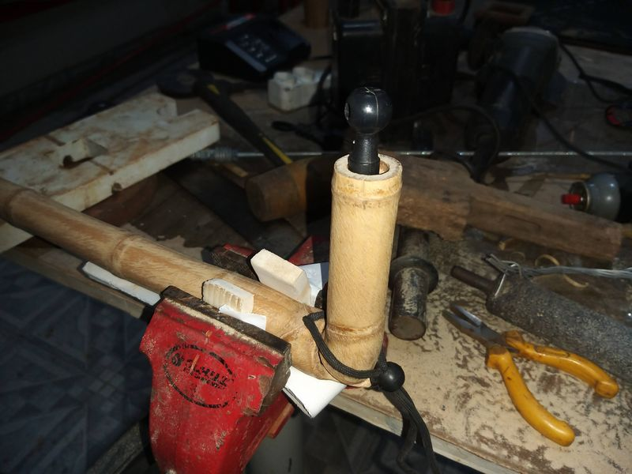
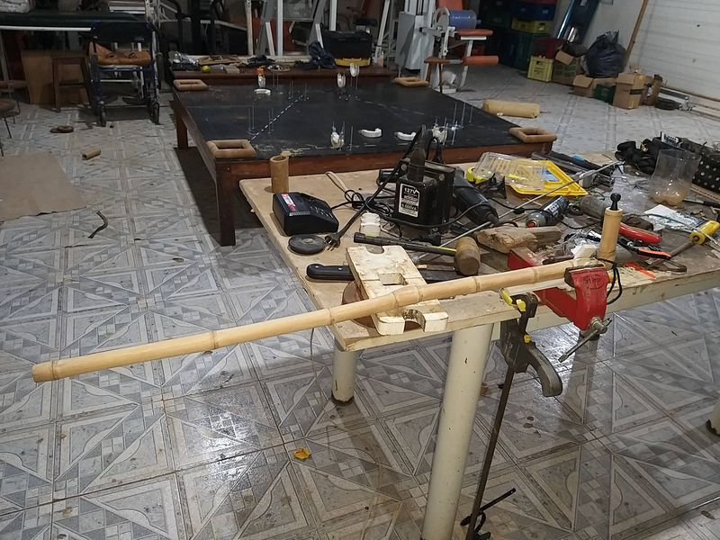
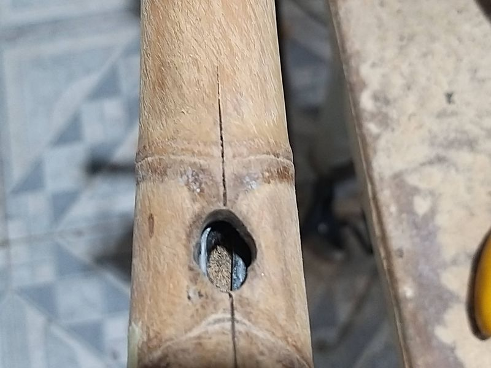
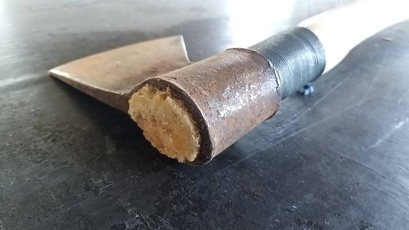

# Memorial Descritivo: Sistema de Reforço Interno de Colmos de Bambu com Espuma de Poliuretano Vegetal

## Título da Invenção

Sistema Integrado de Reforço Interno de Colmos de Bambu Utilizando Espuma de Poliuretano Vegetal, Elementos Tensionados e Fibras de Bambu

## Campo da Invenção

Esta invenção insere-se no âmbito da engenharia civil, da arquitetura sustentável e da ciência de materiais, focando no desenvolvimento de métodos e sistemas construtivos inovadores que promovem a utilização eficiente e aprimorada de recursos naturais renováveis, com ênfase no reforço estrutural de elementos à base de bambu.

## Antecedentes da Invenção

O bambu tem sido historicamente e continua a ser uma escolha popular em construções que buscam sustentabilidade, principalmente devido à sua notável resistência, leveza e capacidade de rápida regeneração. No entanto, o aproveitamento do bambu como material estrutural de alto desempenho, comparável a materiais convencionais como aço ou concreto, enfrenta limitações inerentes à sua forma oca natural, à variação significativa de suas propriedades mecânicas entre espécies e condições de crescimento, e à sua suscetibilidade a ataques de agentes biológicos e à absorção de umidade. Métodos anteriores para reforçar o bambu frequentemente não abordavam de forma integral os desafios relacionados à estabilidade estrutural aprimorada, à elevação da capacidade de carga e ao prolongamento efetivo da durabilidade em aplicações mais exigentes.

## Descrição da Invenção

A inovação proposta consiste em um sistema integrado de reforço interno para colmos de bambu, que utiliza primariamente a aplicação de uma espuma de poliuretano vegetal. Esta espuma é injetada no interior dos colmos, que são preparados e, em muitos casos, já montados em segmentos ou parte da estrutura. O sistema é complementado pela incorporação estratégica de elementos tensionados, como cabos de aço, e/ou pelo uso de fibras ou ripas de bambu posicionadas internamente ou atravessando pontos de união. Esta combinação visa fornecer reforço adicional, melhorar a distribuição de cargas e aumentar a rigidez e a resistência do colmo e das conexões.

<iframe width="560" height="315" src="https://www.youtube.com/embed/INgteu2UZGQ?si=y_6DJJEiuSHxZSKa" title="YouTube video player" frameborder="0" allow="accelerometer; autoplay; clipboard-write; encrypted-media; gyroscope; picture-in-picture; web-share" referrerpolicy="strict-origin-when-cross-origin" allowfullscreen></iframe>

## Objetivos da Invenção

O sistema e método propostos buscam atingir os seguintes objetivos:

1.  Elevar substancialmente a resistência estrutural dos colmos de bambu, tornando-os aptos a suportar cargas maiores e mais complexas.
2.  Aumentar significativamente a estabilidade e a durabilidade das construções que utilizam bambu como elemento estrutural, protegendo-o contra deformações, fissuras e agentes de deterioração internos.
3.  Oferecer um método construtivo eficiente, que otimiza o uso do bambu, é sustentável do ponto de vista ambiental (utilizando polímero de base vegetal) e potencialmente de baixo custo em comparação com outras técnicas de reforço ou materiais estruturais.
4.  Possibilitar a utilização mais versátil e confiável do bambu em uma ampla gama de estilos estruturais e concepções arquitetônicas, incluindo estruturas de maior porte e complexidade.

## Descrição Detalhada do Processo

O processo inovador para o reforço interno de colmos de bambu geralmente envolve as seguintes etapas:

1.  **Preparação dos Colmos:** Seleção, tratamento (se necessário, para preservação externa contra agentes biológicos) e preparação dos colmos de bambu. Isso inclui a realização de furos estratégicos para injeção da espuma e para passagem de elementos de reforço (cabos, ripas), bem como a preparação de encaixes ou conexões onde os colmos serão unidos ou integrados a outros elementos estruturais.
2.  **Posicionamento dos Elementos de Reforço:** Introdução e posicionamento de cabos de aço, fibras de bambu, ripas ou outros elementos de reforço no interior dos colmos ou atravessando os pontos de união que receberão a injeção da espuma. Estes elementos podem ser pré-tensionados, se o design estrutural assim o exigir.
3.  **Montagem e Pré-estruturação:** Os colmos preparados, já com os elementos de reforço posicionados, são montados e fixados conforme o design da estrutura ou do componente (viga, pilar, etc.). As junções entre segmentos de bambu ou entre bambu e outros materiais são estabelecidas.
4.  **Selagem:** Selagem cuidadosa dos furos de injeção, das extremidades dos colmos e de quaisquer outras aberturas ou junções que possam permitir o vazamento da espuma de poliuretano vegetal durante a injeção. Materiais adequados (fitas, massas, etc.) são utilizados para garantir a contenção.
5.  **Injeção da Espuma:** A espuma de poliuretano vegetal é preparada (mistura dos componentes) e injetada no interior dos colmos através dos furos previamente selados. A injeção é realizada de forma controlada para garantir o preenchimento adequado do espaço oco, envolvendo os elementos de reforço internos e aderindo às paredes do bambu.
6.  **Cura e Acabamento:** Após a injeção, a espuma passa pelo processo de cura, solidificando-se e conferindo rigidez ao conjunto. Uma vez curada, excessos de espuma podem ser removidos, e o acabamento final da superfície externa do colmo ou da junção é realizado.

  <h4 class="carousel-title">Cabos para Ferramentas - 2024</h4>
  

    

      <ul class="splide__list">
        <li class="splide__slide">
          
        </li>
        <li class="splide__slide">
          
        </li>
        <li class="splide__slide">
          
        </li>
        <li class="splide__slide">
          
        </li>
        <li class="splide__slide">
          
        </li>
        <li class="splide__slide">
          
        </li>
        <li class="splide__slide">
          
        </li>
        <li class="splide__slide">
          
        </li>
        <li class="splide__slide">
          
        </li>
        <li class="splide__slide">
          
        </li>
        <li class="splide__slide">
          
        </li>
        <li class="splide__slide">
          
        </li>
        <li class="splide__slide">
          
        </li>
        <li class="splide__slide">
          
        </li>
        <li class="splide__slide">
          
        </li>
        <li class="splide__slide">
          
        </li>
        <li class="splide__slide">
          
        </li>
        <li class="splide__slide">
          
        </li>
        <li class="splide__slide">
          
        </li>
        <li class="splide__slide">
          
        </li>
        <li class="splide__slide">
          
        </li>
        <li class="splide__slide">
          
        </li>
        <li class="splide__slide">
          
        </li>
        <li class="splide__slide">
          
        </li>
        <li class="splide__slide">
          
        </li>
      </ul>
    

  

## Abrangência da Invenção (Sumário das Reivindicações)

A proteção e o escopo desta invenção, conforme detalhado, abrangem:

*   O sistema de reforço interno de colmos de bambu que utiliza a injeção de espuma de poliuretano vegetal.
*   A integração e o uso conjunto da espuma de poliuretano vegetal com elementos tensionados, como cabos de aço, posicionados estrategicamente no interior dos colmos ou em pontos de conexão.
*   O uso adicional de fibras ou ripas de bambu como elementos de reforço internos, integrados à espuma de poliuretano vegetal.
*   O método completo de reforço interno, que inclui as etapas de preparação do bambu, posicionamento dos elementos de reforço, montagem prévia, selagem, injeção da espuma de PU vegetal e cura.
*   A aplicação destas técnicas e sistema para reforçar colmos de bambu utilizados em diversos tipos de estruturas, componentes e concepções arquitetônicas no local da obra ou em pré-fabricação.

## Resumo da Invenção

Este sistema e método de reforço interno de colmos de bambu para construções sustentáveis envolve a injeção de espuma de poliuretano vegetal no espaço oco do colmo, frequentemente em conjunto com elementos de reforço como cabos de aço e fibras/ripas de bambu. Esta técnica proporciona um aumento significativo na resistência estrutural, na estabilidade e na durabilidade do bambu, superando limitações intrínsecas do material natural e expandindo seu potencial de uso em diversas aplicações estruturais e arquitetônicas.

## Desenhos (Placeholder)

[Os desenhos técnicos detalhados das etapas do processo, da montagem estrutural e do sistema de reforço interno serão inseridos aqui.]

## Exemplos de Execução (Placeholder)

[Descrição de casos práticos onde a invenção foi implementada em construções, incluindo dados de testes de resistência e durabilidade, se disponíveis.]

## Conclusão

Esta invenção representa um avanço importante para a indústria de materiais e construção sustentável. Ao propor um sistema eficaz de reforço interno para colmos de bambu que combina espuma de poliuretano vegetal com elementos tensionados e fibras, ela apresenta uma solução inovadora para superar as limitações do bambu como material estrutural. Este sistema não apenas aumenta substancialmente a resistência, estabilidade e durabilidade do bambu, mas também promove a sustentabilidade através do uso de um polímero de base vegetal e expande a versatilidade arquitetônica permitida pelo bambu.

---

  <h4 class="carousel-title">Gabaritos para Construção com Bambu</h4>
  

    

      <ul class="splide__list">
        <li class="splide__slide">
          
          
20240325 120640

        </li>
        <li class="splide__slide">
          
          
20240325 174512

        </li>
        <li class="splide__slide">
          
          
20240325 193151

        </li>
        <li class="splide__slide">
          
          
20240325 193208

        </li>
        <li class="splide__slide">
          
          
20240326 201731

        </li>
        <li class="splide__slide">
          
          
20240326 201805

        </li>
        <li class="splide__slide">
          
          
20240326 201821

        </li>
        <li class="splide__slide">
          
          
20240327 174047

        </li>
        <li class="splide__slide">
          
          
20240327 174052

        </li>
        <li class="splide__slide">
          
          
20240327 180609

        </li>
        <li class="splide__slide">
          
          
20240327 180625

        </li>
        <li class="splide__slide">
          
          
20240328 190306

        </li>
        <li class="splide__slide">
          
          
20240328 190318

        </li>
        <li class="splide__slide">
          
          
20240329 085138

        </li>
        <li class="splide__slide">
          
          
20240329 203503

        </li>
        <li class="splide__slide">
          
          
20240329 203508

        </li>
        <li class="splide__slide">
          
          
20240329 212336

        </li>
        <li class="splide__slide">
          
          
20240329 212351

        </li>
        <li class="splide__slide">
          
          
20240330 110826

        </li>
        <li class="splide__slide">
          
          
20240330 110833

        </li>
        <li class="splide__slide">
          
          
20240330 110836

        </li>
        <li class="splide__slide">
          
          
20240330 110852

        </li>
      </ul>
    

  

