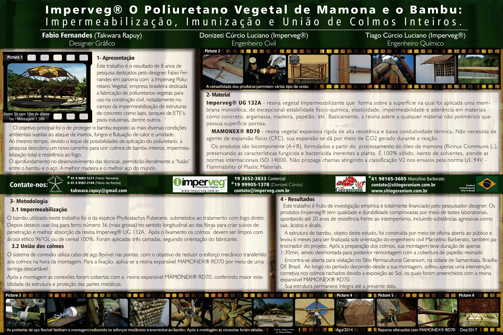

# Sistema de Conexões Semiflexíveis com Cabo de Aço para Estruturas Geodésicas de Bambu

## Campo de Aplicação

A presente invenção descreve um sistema inovador de conexões utilizando cabos de aço e terminais específicos para a construção de estruturas geodésicas, com foco especial no uso do bambu como elemento estrutural.

## Problemas das Conexões Tradicionais

Os métodos convencionais de conexão entre elementos estruturais de bambu frequentemente envolvem técnicas como amarração com fibras naturais ou sintéticas, uso de barras roscadas metálicas, tubos de PVC ou ponteiras de aço usinadas. Embora amplamente utilizadas, essas técnicas apresentam diversas desvantagens:

*   **Baixa Resistência e Durabilidade:** Muitas vezes, não oferecem a resistência ou a longevidade necessárias para aplicações estruturais de maior porte.
*   **Danos ao Bambu:** O uso de elementos rígidos, especialmente metálicos, pode criar pontos de concentração de tensões e atrito destrutivo, danificando o colmo de bambu.
*   **Complexidade de Execução:** Alguns métodos requerem mão de obra especializada ou ferramentas complexas, dificultando a montagem em larga escala ou em locais de difícil acesso.
*   **Rigidez Excessiva:** Métodos rígidos podem não acomodar adequadamente as pequenas movimentações e ajustes necessários em estruturas complexas como domos geodésicos.

## Descrição do Sistema Proposto

O sistema de conexão proposto busca superar as limitações dos métodos tradicionais, oferecendo uma solução mais eficiente, durável e de fácil montagem. Ele baseia-se na utilização de cabos de aço flexíveis, pré-tensionados internamente aos colmos de bambu.

### Componentes e Princípios

*   **Cabos de Aço Flexíveis:** A flexibilidade do cabo permite acomodar os diferentes ângulos de inclinação e a geometria complexa inerente às estruturas geodésicas de várias frequências.
*   **Pré-tensionamento Interno:** O cabo é tensionado dentro do colmo, conferindo a rigidez estrutural necessária ao elemento de bambu.
*   **Terminais Padrão:** Nas extremidades do cabo, são utilizados terminais convencionais para cabos de aço, como sapatilhas (para formar olhais protegidos) e prensas-cabo (para fixar o laço). A escolha desses componentes padrão facilita o acesso aos materiais e reduz custos.
*   **Distribuição de Cargas:** O sistema emprega elementos para distribuir uniformemente as cargas na interface entre o cabo e o bambu, evitando concentrações excessivas que poderiam danificar o colmo.
*   **Facilidade de Montagem:** A concepção do sistema permite uma montagem rápida e prática, dispensando a necessidade de ferramentas complexas no canteiro de obras.

## Processo de Montagem e Conexão

A união de dois segmentos de bambu (ou um segmento e um nó central) utilizando este sistema envolve uma preparação específica do colmo e uma sequência de passos para inserir e tensionar o cabo de aço. A espessura do cabo é determinada pela carga prevista, bem como pela espécie e diâmetro do bambu utilizado.

Para cada extremidade do colmo de bambu a ser conectada, realiza-se a seguinte preparação:

1.  **Perfuração:** O colmo de bambu selecionado deve ter quatro orifícios em cada ponta. Realizam-se dois furos perpendiculares à fibra a aproximadamente 5 cm da extremidade e outros dois furos perpendiculares a aproximadamente 3 cm da extremidade. Além disso, os furos de entrada para o cabo (que podem ser os de 5 cm, dependendo da direção) devem ser feitos com um ângulo de aproximadamente 45° em relação à superfície do bambu, no sentido de entrada do cabo, com diâmetro correspondente à espessura do cabo escolhido.
2.  **Preparação do Cabo:** Um segmento de cabo de aço, com comprimento aproximado de 1 metro, é preparado. Na porção mediana desse segmento, fixa-se uma sapatilha utilizando uma prensa-cabo, criando um laço protegido.
3.  **Inserção da Arruela Externa:** Uma arruela com diâmetro compatível com o colmo é inserida nas duas pontas soltas do cabo preparado. Esta arruela servirá como "tampão" externo, auxiliando na distribuição da carga e no acabamento.
4.  **Passagem Interna do Cabo:** As duas pontas soltas do cabo são inseridas no interior do colmo através dos orifícios feitos a 5 cm da extremidade (com ângulo de 45°). As pontas, de forma cruzada no interior do colmo, penetram novamente para o exterior pelos orifícios feitos a 3 cm da extremidade.
5.  **Passagem Externa Cruzada:** As pontas do cabo, agora do lado externo do colmo, cruzam-se e retornam para o interior através dos mesmos orifícios de 3 cm.
6.  **Saída Final do Cabo:** As duas pontas do cabo seguem juntas no interior do colmo e saem novamente para o exterior através do orifício central da arruela externa inserida na etapa 3.
7.  **Tensionamento Inicial e Fixação Interna:** Neste ponto, uma segunda prensa-cabo é inserida sobre as duas pontas do cabo que saem pela arruela externa. A prensa-cabo deve ter uma dimensão maior que o orifício central da arruela. Ao puxar as pontas do cabo e deslizar a prensa-cabo contra a arruela, realiza-se o tensionamento inicial do cabo no interior do colmo. A prensa-cabo atua como ponto de apoio interno contra a arruela externa.
8.  **Tensionamento Final (Abraçadeira):** Durante a passagem do cabo entre os orifícios de 5 cm e 3 cm, formam-se pequenos olhais externos. Um segmento do mesmo cabo (ou outro cabo menor) passa por esses olhais, formando uma espécie de abraçadeira externa em torno da extremidade do bambu. Ao tensionar esta abraçadeira, promove-se o tensionamento final do cabo principal no interior do colmo.
9.  **Isolamento e Preenchimento:** Realiza-se o isolamento dos orifícios externos para posterior vedação. Uma injeção de PU Vegetal Expansivo de alta densidade é aplicada para preencher os vazios internos na extremidade do colmo, fixando o cabo e a prensa-cabo interna, e proporcionando proteção.

## Vantagens do Sistema

*   **Durabilidade Aumentada:** O uso de cabos de aço protegidos internamente e a vedação com PU Vegetal reduzem a exposição do metal à corrosão e do bambu à umidade e insetos.
*   **Rigidez com Flexibilidade:** A combinação de pré-tensionamento e cabo flexível confere rigidez estrutural ao elemento, ao mesmo tempo que permite a acomodação dos ângulos em estruturas complexas.
*   **Distribuição de Cargas:** As arruelas e o sistema de tensionamento distribuem as cargas de forma mais uniforme na interface com o bambu, minimizando danos.
*   **Montagem Simplificada:** Utiliza componentes padrão de fácil acesso e um processo que dispensa ferramentas especializadas para a conexão em si.
*   **Potencial de Sustentabilidade:** Integra o uso de PU Vegetal, um material de base biológica, e permite o uso estrutural de bambu, um recurso renovável.

## Aplicações

Este sistema é especialmente desenvolvido para a construção de cúpulas geodésicas de bambu, onde os elementos se conectam formando módulos triangulares. No entanto, sua concepção permite que seja empregado em outros tipos de estruturas espaciais que utilizem o bambu como elemento principal.

## Especificações de Materiais e Preparação do Bambu

*   **Cabo de Aço:** A espessura do cabo de aço deve ser dimensionada com base na carga solicitada para o elemento estrutural, considerando as propriedades da espécie e o diâmetro do colmo de bambu a ser utilizado.
*   **Colmo de Bambu:** O colmo deve ser preparado conforme descrito no processo de montagem, com os furos nos locais e ângulos especificados para permitir a passagem e o tensionamento do cabo. Recomenda-se selecionar bambus de espécies adequadas para uso estrutural, com diâbres e espessuras de parede compatíveis.

## Finalização e Proteção

Após a cura completa da espuma de PU Vegetal expansivo injetada, as extremidades conectadas do bambu devem receber um revestimento protetor. Este revestimento consiste na aplicação sucessiva de camadas de PU Vegetal e fibras de sisal. O processo, semelhante à laminação com fibra de vidro, cobre cerca de 6 cm da extremidade do bambu, protegendo as partes metálicas visíveis (incluindo a arruela externa) e proporcionando um acabamento durável.

## Considerações Finais 
O sistema de conexões com cabo de aço pré-tensionado e terminais padrão, fixado nas extremidades dos colmos de bambu, representa um avanço técnico para a construção com este material. A adaptação das técnicas de uso de cabo de aço, comum em outras áreas, para criar uma ligação interna e semiflexível no bambu, juntamente com o uso de PU Vegetal para fixação e proteção, oferece uma solução robusta. A preparação específica do colmo com furos angulados e cruzados é fundamental para a funcionalidade do sistema de tensionamento interno. A criação dos olhais externos e a utilização de uma prensa-cabo interna contra a arruela externa são mecanismos chave para o pré-tensionamento. O tensionamento final através da abraçadeira externa garante a rigidez necessária. O preenchimento com PU Vegetal Expansivo e o revestimento externo com PU e sisal asseguram a durabilidade e proteção da conexão, cobrindo as partes metálicas e a arruela externa.

