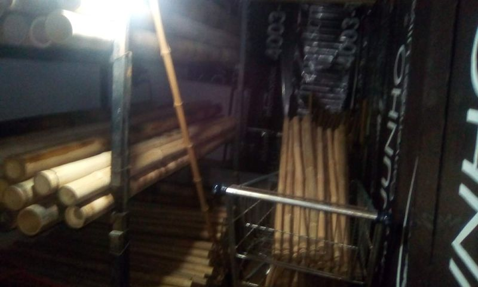
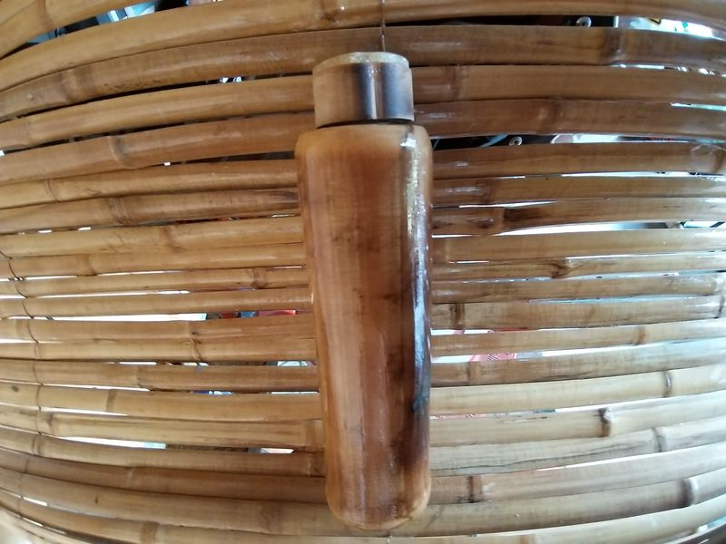

Of course. Here is the complete translation of the text into English, preserving the original formatting.

# Takwara: An Authorial and Irreverent Approach to Sustainability with Bamboo

    

## Welcome to the Takwara Repository: Your Portal to Open Innovation in Sustainable Construction

**1. The Flame of Self-Determination: Welcome to the Takwara Revolution\!**

Hello\! A warm welcome to the **Takwara Technology** repository. Here, we not only share cutting-edge solutions in sustainable construction with bamboo but also celebrate a journey of authentic learning and direct confrontation with the crises that define our time: the housing crisis, the climate emergency, and the need for a socio-environmentally responsible future.

What you will find here is the result of the vision and tireless research of Fabio "Takwara" Resck, a **self-taught** researcher by essence and by choice. He forged a learning path that breaks from conventional molds, shaping his education according to the needs and passions that drive him. This educational independence allowed for the development of multiple skills – from editor to programmer, from philosopher to technological innovator – culminating in advances such as ecological bamboo treatments and the revolutionary waterproofing with Vegetal PU.

And to debunk any prejudice: being an empirical research and repository does not make our content "negligible." On the contrary\! Society often underestimates autodidacts, but it is the creative and innovative nature of these individuals that allows for the envisioning of new possibilities. We believe that **anyone, of any nationality or educational level, can learn, interact, and be inspired** by what we share here. Just take a look at the **Takwara Virtual Assistant**, in the upper right corner of this page. She is ready to answer your questions, whether they are simple – even with spelling or grammar mistakes – or complex and technical. She is proof that knowledge is for everyone\!

Our goal is clear: to democratize access to construction techniques that are **ecological, economically viable, socially inclusive**, and, above all, capable of generating a real and positive impact. We believe in the power of bamboo – our "vegetable steel" – and in ancestral wisdom combined with modern science to redesign our relationship with the built environment.

**2. From Fabio Resck to Takwara Rapuy: An Epic Baptism at the Crossroads of Struggle**

\<iframe width="560" height="315" src="[https://www.youtube.com/embed/LsLk0zBADag?si=26DGxdJaEmBiPv\_r](https://www.youtube.com/embed/LsLk0zBADag?si=26DGxdJaEmBiPv_r)" title="YouTube video player" frameborder="0" allow="accelerometer; autoplay; clipboard-write; encrypted-media; gyroscope; picture-in-picture; web-share" referrerpolicy="strict-origin-when-cross-origin" allowfullscreen\>\</iframe\>
*Rio de Janeiro - Jul/ 2012*

This platform, this repository, and the very philosophy of open knowledge that moves us are not just the result of empirical research. They are the echo of a profound personal journey, of a transformative encounter that baptized and shaped me.

The story begins in 2012, at Rio+20, a stage for global discussions on a green future. But just a few kilometers away, the reality was raw: the **Aldeia Maracanã**, an indigenous stronghold in Rio de Janeiro, was fighting to keep its historic mansion from demolition. On that front of resistance, in a gesture of belonging and reinvention, I proposed a symbol: a **bamboo geodesic dome**, a "soccer ball" to strengthen the movement. The innovation was in my connections, an ingenious system that compensated for the natural irregularities of bamboo.

Before the indigenous council, led by Chief Afonso Apurinã, and after a silent analysis, an elder delivered the verdict that would change everything: **"You are now Takwara Rapuy. Bamboo House."** The white man's house was accepted as an Indian's house. Shortly after, politics intervened, the council accepted a settlement, and the structure I was assembling in Jacarepaguá began to crack, pole by pole, as if the work itself felt the pain of that agreement.

This story, which matured into the discovery of a revolutionary biocomposite of bamboo and castor bean, is the guiding thread of this collection. It is intertwined with the constant struggle of the indigenous movement against physical annihilation, political co-optation, and cultural erasure. And, more than anything, it forged in me the resilience and vision that led me to follow the path of an autodidact, challenging standards and building innovative solutions.

That is why, when you find expressions like "we believe," "our goals," or "together we can transform," know that this "we" embraces this history, this struggle, and all who, from near or far, contributed to making this journey possible.

**3. The Unpostponable Challenge: Climate, Social, and Housing Crises – An Urgent Call to Action\!**

\<iframe width="560" height="315" src="[https://www.youtube.com/embed/RKLnMJ5rkUY?si=njTbH7fzbqg77lsE](https://www.youtube.com/embed/RKLnMJ5rkUY?si=njTbH7fzbqg77lsE)" title="YouTube video player" frameborder="0" allow="accelerometer; autoplay; clipboard-write; encrypted-media; gyroscope; picture-in-picture; web-share" referrerpolicy="strict-origin-when-cross-origin" allowfullscreen\>\</iframe\>
*Brasília, May/2014*

The planet is on fire. The climate, social, and housing crises demand more than palliative solutions; they cry out for **radical transformation**. The conventional construction industry, a silent villain, devours resources and emits carbon, perpetuating an unsustainable model. Millions struggle for a decent roof over their heads while the green future is discussed in air-conditioned rooms.

It is in this scenario that **Takwara Technology emerges as a hopeful and concrete response.** Through the intelligent and sustainable use of bamboo – our "**vegetable steel**" – and the valorization of waste, we transform this renewable resource into decent housing, autonomy for vulnerable communities, and a pillar for a just future in harmony with nature.

Bamboo, as detailed in our article **"A Response to the Housing Crisis"**, is a key to the Sustainable Development Goals (SDGs) of the 2030 Agenda. And Brazil, with its immense natural wealth, has a colossal potential to become a global leader in this area. Takwara Technology is the catalyst Brazil needs for bamboo to assume its rightful place as a protagonist in building a more sustainable and equitable country.

**4. The Takwara Methodology: Innovation that Builds the Future**

\<iframe width="560" height="315" src="[https://www.youtube.com/embed/B\_fAxUKHWg0?si=TBgpXUMfS8v2qVUW](https://www.youtube.com/embed/B_fAxUKHWg0?si=TBgpXUMfS8v2qVUW)" title="YouTube video player" frameborder="0" allow="accelerometer; autoplay; clipboard-write; encrypted-media; gyroscope; picture-in-picture; web-share" referrerpolicy="strict-origin-when-cross-origin" allowfullscreen\>\</iframe\>

Our methodology is an integrated system that overcomes the traditional challenges of bamboo, focusing on sustainability, efficiency, and accessibility.

  * **4.1. Ecological Kiln and Pyroligneous Steam Treatment: The Green Treatment of Bamboo**
    Inspired by Rocket Stoves, our Ecological Kiln optimizes bamboo treatment with pyroligneous extract (a byproduct of the pyrolysis of bamboo's own biomass), eliminating the need for toxic salts. The saturated steam process is faster, more efficient, and safer, resulting in ecologically treated bamboo free of harmful chemicals. (Detailed memorial in the article: *Ecological Kiln and Pyroligneous Steam Treatment*)

  * **4.2. Flexible Connections with Vegetal PU: Resilient and Adaptable Bamboo Geodesics**
    We have revolutionized bamboo geodesic domes with flexible and durable connections. Our design allows for intelligent articulation and stress distribution, overcoming the rigidity and natural variations of the plant. The ends of the culms are sealed with our **Expansive Vegetal Polyurethane (PU)**, reinforcing the structure for maximum load-bearing capacity. (More details, diagrams, and studies in: *Geodesic Connections*)

    \<iframe width="560" height="315" src="[https://www.youtube.com/embed/NaSf1oGeMIA?si=NU7P8pqfC0J1kv4q](https://www.youtube.com/embed/NaSf1oGeMIA?si=NU7P8pqfC0J1kv4q)" title="YouTube video player" frameborder="0" allow="accelerometer; autoplay; clipboard-write; encrypted-media; gyroscope; picture-in-picture; web-share" referrerpolicy="strict-origin-when-cross-origin" allowfullscreen\>\</iframe\>

  * **4.3. Waterproofing with Vegetal PU: The "Green Weld" that Protects Bamboo**
    In contrast to synthetic waterproofers, we honor the legacy of Prof. Dr. Gilberto Orivaldo Chierice, using **Vegetal Polyurethane (PU) from Imperveg** ([www.imperveg.com](https://www.imperveg.com).br), a fundamental ally. Vegetal PU is non-toxic, its renewable origin aligns with the bioeconomy, and its application in two to three coats provides superior and long-lasting protection to bamboo. (Comparative analysis and details: *Synthetics vs. Organics* and *Treatment and Commercialization of Bamboo Poles*)

  * **4.4. Eco-composites with Vegetal PU: Transforming Waste into Resources and Opportunities**
    We believe that waste is just raw material waiting to be rediscovered. Our eco-composites, using Vegetal PU as a binder, transform bamboo scraps and other waste into durable and safe materials. (More in: The Green and Yellow Bio-revolution and The Treasure Map) The formula is simple and powerful: **Selected Waste + 20-25% Vegetal PU + Pressing/Molding = Sustainable Eco-composites**. The possibilities are endless: panels, sheets, ecological bricks, components for tiny houses. (Details in: *Bricks and Briquettes* and *Social Interest Housing and Briquettes*)

**Takwara Technology is more than material innovation; it is a tool for social, economic, and environmental transformation.**

\

\<h4 class="carousel-title"\>10m Dome with Cardboard Cover - 2014/17\</h4\>
\

\

\<ul class="splide\_\_list"\>
\<li class="splide\_\_slide"\>
\
\</li\>
\<li class="splide\_\_slide"\>
\
\</li\>
\<li class="splide\_\_slide"\>
\
\</li\>
\<li class="splide\_\_slide"\>
\
\</li\>
\<li class="splide\_\_slide"\>
\
\</li\>
\<li class="splide\_\_slide"\>
\
\</li\>
\<li class="splide\_\_slide"\>
\
\</li\>
\<li class="splide\_\_slide"\>
\
\</li\>
\<li class="splide\_\_slide"\>
\
\</li\>
\<li class="splide\_\_slide"\>
\
\</li\>
\<li class="splide\_\_slide"\>
\
\</li\>
\</ul\>
\</div\>
\</div\>
\</div\>

**Our Potential for Impact:**

  * **Income Generation and Quality of Life:** Through **Community Hubs for Bamboo Production and Innovation (Takwara Hubs)**, we empower communities with sustainable management, ecological treatment, resilient construction, and eco-composite production, generating autonomy, green jobs, and improved quality of life.
  * **Alignment with SDGs:** We contribute to SDG 1 (No Poverty), SDG 8 (Decent Work), SDG 9 (Industry, Innovation), SDG 11 (Sustainable Cities), SDG 12 (Responsible Consumption), and SDG 13 (Climate Action) – sequestering carbon and reducing the construction footprint.
  * **Untapped Brazilian Potential:** Brazil, with its vast bamboo potential, can lead the global market. Takwara Technology is the way forward.
  * **Grassroots Actions for Global Transformation:**
      * **Focus on Communities:** We implement solutions in rural areas, peripheries, and disaster-affected regions, transforming local resources into decent housing and autonomy.
      * **Training Multipliers:** The Takwara Hubs train "Guardians and Artisans of Bamboo" who disseminate the technology in their territories.
      * **Productive Inclusion and Female Protagonism:** We promote gender equity and the economic empowerment of women at all stages.
      * **Connecting Generations:** We invite young students and professionals to learn, adapt, and innovate from this foundation.

**5. The Journey of Takwara Tech: From Conception to Open Dissemination**

\<iframe width="560" height="315" src="[https://www.youtube.com/embed/hHGkicTDXEk?si=gGeb7uApuINjvwgB](https://www.youtube.com/embed/hHGkicTDXEk?si=gGeb7uApuINjvwgB)" title="YouTube video player" frameborder="0" allow="accelerometer; autoplay; clipboard-write; encrypted-media; gyroscope; picture-in-picture; web-share" referrerpolicy="strict-origin-when-cross-origin" allowfullscreen\>\</iframe\>

This technology is the result of over a decade of independent research, passion for sustainability, and resilience forged in the field.

  * **Seeds in Minas and Arrival in Brasília (Pre-2018):** The first prototypes and frustration with conventional methods gave rise to the Ecological Kiln and flexible connections.
  * **Community Effervescence and Academic Recognition (2018-2019, Brasília):** Collaborations with UnB (Planaltina) and IFB (Planaltina) validated the social and educational impact of the work, despite political and funding challenges. (See `/Historico_Projeto_Parcerias/UnB_LaPeCFaS/` and `/Historico_Projeto_Parcerias/IFB_Planaltina/`).
  * **Endorsement from a Master and Pandemic Pause (2019-2020):** The meeting with Prof. Dr. Jayme Gonçalves (UnB) and his validation marked the path, with the search for solutions continuing even during the pandemic. (Documents in `/Historico_Projeto_Parcerias/Outras_Iniciativas/`).
  * **Strategic Decision for Openness (2022-2024):** Partnerships and the subsequent release of the IP consolidated the path to open publication on GitHub. (Documentation in `/Historico_Projeto_Parcerias/CEFET_MG/`).
  * **New Horizons (2024-Present):** In Limeira-SP, the research continues in a new workshop dedicated to improving Takwara Technology and developing new social patents.

This journey, with its ups and downs, reinforced an unwavering belief: knowledge that generates collective well-being and environmental regeneration must flow freely.

\<iframe width="560" height="315" src="[https://www.youtube.com/embed/OGeVIEGZfb0?si=rLv2LtlGvqx\_KIsr](https://www.youtube.com/embed/OGeVIEGZfb0?si=rLv2LtlGvqx_KIsr)" title="YouTube video player" frameborder="0" allow="accelerometer; autoplay; clipboard-write; encrypted-media; gyroscope; picture-in-picture; web-share" referrerpolicy="strict-origin-when-cross-origin" allowfullscreen\>\</iframe\>

**6. The Essential Context: Pre-COP30 and the Urgency of the Message**

As we approach COP30, the urgency of climate action and social justice intensifies. This repository, the **Takwara Technology**, and our **Virtual Assistant** are more than just data; they are a testament to human ingenuity and resilience in the face of global challenges. The Takwara spirit – which embraces innovation, independence, and a deep connection with nature – offers a powerful model.

**---**
**A Call to Action: Embracing the Takwara Spirit for COP30**

This platform, born from a autodidactic journey and a commitment to ecological innovation, is more than a repository of knowledge; it is a testament to human ingenuity and resilience. As we approach COP30, the urgency of climate action and social justice demands that we embrace unconventional solutions and diverse voices. The Takwara ethos – embodying innovation, independence, and a deep connection to nature – offers a powerful model for tackling global challenges. We urge all Brazilians and international allies who share these principles to **become TAKWARA**: actively participate, amplify your voice, and collaborate to build a sustainable future. Your learning, your action, and your unique perspective are vital in this critical fight.
**---**

\

\<h4 class="carousel-title"\>Vacation with Bamboo - IFB Planaltina - 2019/20\</h4\>
\

\

\<ul class="splide\_\_list"\>
\<li class="splide\_\_slide"\>
\
\</li\>
\<li class="splide\_\_slide"\>
\
\</li\>
\<li class="splide\_\_slide"\>
\
\</li\>
\<li class="splide\_\_slide"\>
\
\</li\>
\<li class="splide\_\_slide"\>
\
\</li\>
\<li class="splide\_\_slide"\>
\
\</li\>
\<li class="splide\_\_slide"\>
\
\</li\>
\<li class="splide\_\_slide"\>
\
\</li\>
\<li class="splide\_\_slide"\>
\
\</li\>
\<li class="splide\_\_slide"\>
\
\</li\>
\<li class="splide\_\_slide"\>
\
\</li\>
\<li class="splide\_\_slide"\>
\
\</li\>
\<li class="splide\_\_slide"\>
\
\</li\>
\<li class="splide\_\_slide"\>
\
\</li\>
\<li class="splide\_\_slide"\>
\
\</li\>
\<li class="splide\_\_slide"\>
\
\</li\>
\<li class="splide\_\_slide"\>
\
\</li\>
\<li class="splide\_\_slide"\>
\
\</li\>
\<li class="splide\_\_slide"\>
\
\</li\>
\<li class="splide\_\_slide"\>
\
\</li\>
\<li class="splide\_\_slide"\>
\
\</li\>
\<li class="splide\_\_slide"\>
\
\</li\>
\<li class="splide\_\_slide"\>
\
\</li\>
\<li class="splide\_\_slide"\>
\
\</li\>
\<li class="splide\_\_slide"\>
\
\</li\>
\<li class="splide\_\_slide"\>
\
\</li\>
\<li class="splide\_\_slide"\>
\
\</li\>
\<li class="splide\_\_slide"\>
\
\</li\>
\<li class="splide\_\_slide"\>
\
\</li\>
\<li class="splide\_\_slide"\>
\
\</li\>
\<li class="splide\_\_slide"\>
\
\</li\>
\<li class="splide\_\_slide"\>
\
\</li\>
\<li class="splide\_\_slide"\>
\
\</li\>
\<li class="splide\_\_slide"\>
\
\</li\>
\<li class="splide\_\_slide"\>
\
\</li\>
\<li class="splide\_\_slide"\>
\
\</li\>
\<li class="splide\_\_slide"\>
\
\</li\>
\<li class="splide\_\_slide"\>
\
\</li\>
\<li class="splide\_\_slide"\>
\
\</li\>
\<li class="splide\_\_slide"\>
\
\</li\>
\<li class="splide\_\_slide"\>
\
\</li\>
\<li class="splide\_\_slide"\>
\
\</li\>
\<li class="splide\_\_slide"\>
\
\</li\>
\<li class="splide\_\_slide"\>
\
\</li\>
\<li class="splide\_\_slide"\>
\
\</li\>
\<li class="splide\_\_slide"\>
\
\</li\>
\<li class="splide\_\_slide"\>
\
\</li\>
\<li class="splide\_\_slide"\>
\
\</li\>
\<li class="splide\_\_slide"\>
\
\</li\>
\<li class="splide\_\_slide"\>
\
\</li\>
\<li class="splide\_\_slide"\>
\
\</li\>
\<li class="splide\_\_slide"\>
\
\</li\>
\<li class="splide\_\_slide"\>
\
\</li\>
\<li class="splide\_\_slide"\>
\
\</li\>
\<li class="splide\_\_slide"\>
\
\</li\>
\<li class="splide\_\_slide"\>
\
\</li\>
\<li class="splide\_\_slide"\>
\
\</li\>
\<li class="splide\_\_slide"\>
\
\</li\>
\<li class="splide\_\_slide"\>
\
\</li\>
\<li class="splide\_\_slide"\>
\
\</li\>
\<li class="splide\_\_slide"\>
\
\</li\>
\<li class="splide\_\_slide"\>
\
\</li\>
\<li class="splide\_\_slide"\>
\
\</li\>
\<li class="splide\_\_slide"\>
\
\</li\>
\</ul\>
\</div\>
\</div\>
\</div\>

**7. Join Us: The Necessary Checkmate\!**

Brazil has immense potential to be a protagonist in building a sustainable future, and bamboo is a key piece. **It's time for a "Check\!"** on the social and representative groups of the bamboo cause. We need Brazil, and the world, to hear our voice and recognize bamboo as a main player in the battle against the climate and social crisis.

**If you share this feeling, this principle, become a TAKWARA\!** Assume your role. The world needs to hear your voice. Be part of this community, collaborate, spread the word, and participate\!

**8. Free Knowledge, Shared Responsibility, and Next Steps**

All original material developed here is licensed under the **Creative Commons Attribution 4.0 International (CC BY 4.0)**. We want maximum dissemination and freedom of use, with fair recognition of the effort undertaken.

  * **Explore:** Dive into the complete technical documentation.
  * **Apply and Adapt:** Use the knowledge in your projects, citing the source and respecting the license.
  * **Collaborate:** Help us with tests, validations, documentation, design, translation, or dissemination.
  * **Get in Touch:** We clarify doubts and offer mentoring.

**9. License**

This project is licensed under the Creative Commons Attribution 4.0 International (CC BY 4.0).
[https://creativecommons.org/licenses/by/4.0/](https://creativecommons.org/licenses/by/4.0/)
Easy-to-read summary: [https://creativecommons.org/licenses/by/4.0/deed.en](https://creativecommons.org/licenses/by/4.0/deed.en)

\

\<h4 class="carousel-title"\>Bamboo Bottles - 2022\</h4\>
\

\

\<ul class="splide\_\_list"\>
\<li class="splide\_\_slide"\>
\
\</li\>
\<li class="splide\_\_slide"\>
\
\</li\>
\<li class="splide\_\_slide"\>
\
\</li\>
\<li class="splide\_\_slide"\>
\
\</li\>
\<li class="splide\_\_slide"\>
\
\</li\>
\<li class="splide\_\_slide"\>
\
\</li\>
\<li class="splide\_\_slide"\>
\
\</li\>
\<li class="splide\_\_slide"\>
\
\</li\>
\<li class="splide\_\_slide"\>
\
\</li\>
\</ul\>
\</div\>
\</div\>
\</div\>

**10. Contact**

Fabio "Takwara" Resck
E-mail: fabiotakwara@gmail.com
WhatsApp: +55 35 99761-1319

-----

**A Call for the Co-Creation of a Sustainable Future\!**

Takwara Technology, now open to the world, is an invitation to co-create a future where human intelligence and nature's generosity unite to generate prosperity, equity, and environmental regeneration. This repository is a seed. We hope it finds fertile ground in creative minds and hands around the planet.

**The Future is Collaborative and Open.**

**How you can be a part:** Learn and Apply; Adapt and Innovate; Share and Disseminate; Connect; Contribute.

We believe that, together, we can transform "vegetable steel" and the principles of Takwara Technology into a powerful force for the regeneration of our planet and for the construction of "Bem Viver" (Good Living) for all.

Thank you for joining us on this journey\!