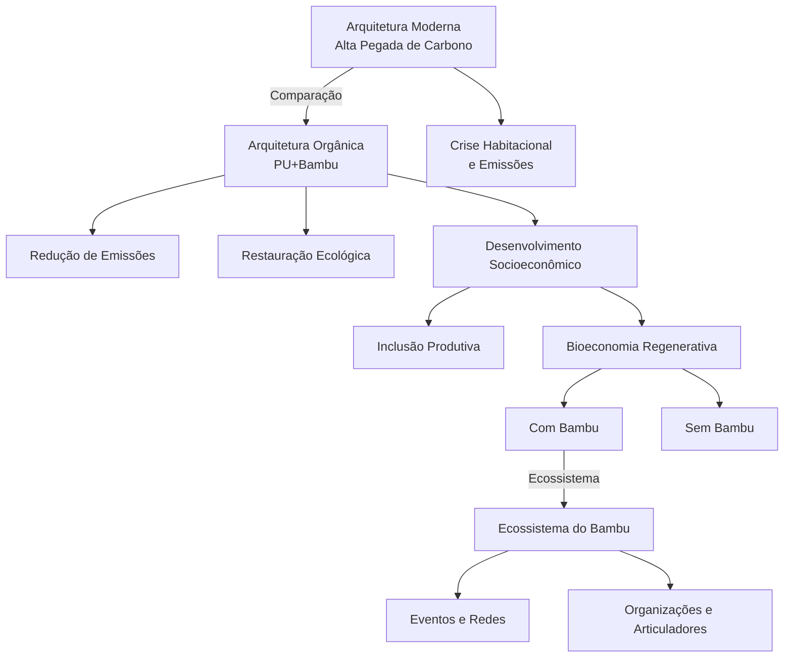

# Grafo da Bioeconomia do Brasil: Arquitetura, Bambu e Desenvolvimento

```mermaid
graph TD
    M[Arquitetura Moderna<br>Alta Pegada de Carbono] -->|Comparação| O[Arquitetura Orgânica<br>PU+Bambu]
    M --> MC[Crise Habitacional<br>e Emissões]
    O --> RE[Redução de Emissões]
    O --> RS[Restauração Ecológica]
    O --> DS[Desenvolvimento Socioeconômico]
    DS --> IN[Inclusão Produtiva]
    DS --> BE[Bioeconomia Regenerativa]
    BE --> CB[Com Bambu]
    BE --> SB[Sem Bambu]
    CB -->|Ecossistema| EC[Ecossistema do Bambu]
    EC --> EV[Eventos e Redes]
    EC --> OR[Organizações e Articuladores]
    click M "https://resck.github.io/Takwara-Tech/maloca-concreto/"
    click O "https://resck.github.io/Takwara-Tech/athis-concreto-bambu/"
    click CB "https://resck.github.io/Takwara-Tech/bambu-urgente/"
    click SB "https://resck.github.io/Takwara-Tech/A6.%20COP30/a5.0%20Dossi%C3%AA%20COP30/"
    click EC "https://resck.github.io/Takwara-Tech/A2.%20%20O%20Bambu/%23%20a2.3%20O%20Ecossistema%20do%20Bambu%20no%20Brasil/"
```