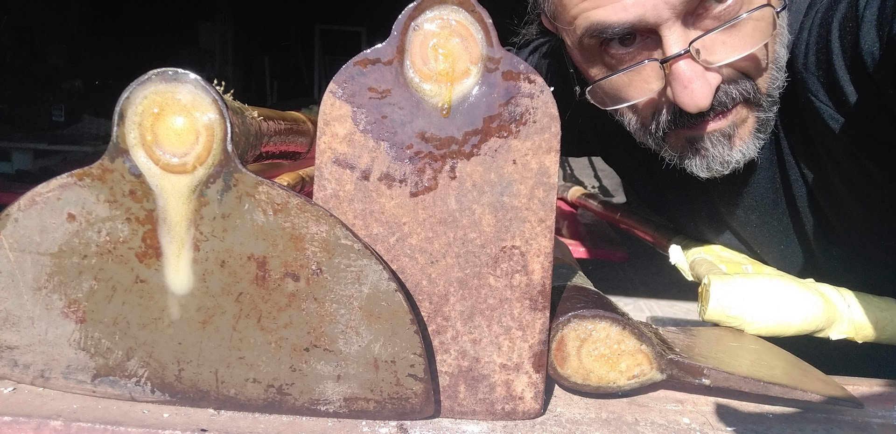

**Takwara: O Código Aberto da Autodeterminação, Inovação com Bambu e uma Convocação à Transformação Socioambiental**

**---**
**A Call to Action: Embracing the Takwara Spirit for COP30**

This platform, born from a autodidactic journey and a commitment to ecological innovation, is more than a repository of knowledge; it is a testament to human ingenuity and resilience. As we approach COP30, the urgency of climate action and social justice demands that we embrace unconventional solutions and diverse voices. The Takwara ethos – embodying innovation, independence, and a deep connection to nature – offers a powerful model for tackling global challenges. We urge all Brazilians and international allies who share these principles to **become TAKWARA**: actively participate, amplify your voice, and collaborate to build a sustainable future. Your learning, your action, and your unique perspective are vital in this critical fight.
**---**

*Este trabalho está licenciado sob a Creative Commons Atribuição 4.0 Internacional.*

**1. A Chama da Autodeterminação: Bem-vindo à Revolução Takwara!**

Olá! Seja muito bem-vindo ao repositório da **Tecnologia Takwara**. Aqui, não apenas compartilhamos soluções de ponta em construção sustentável com bambu, mas também celebramos uma jornada de aprendizado autêntico e de enfrentamento direto às crises que definem nosso tempo: a crise habitacional, a urgência climática e a necessidade de um futuro socioambientalmente responsável.

O que você encontrará aqui é fruto da visão e da pesquisa incansável de Fabio "Takwara" Resck, um pesquisador **autodidata** por essência e por escolha. Ele forjou um caminho de aprendizado que foge dos moldes convencionais, moldando sua educação de acordo com as necessidades e paixões que o movem. Essa independência educativa permitiu o desenvolvimento de habilidades múltiplas – de editor a programador, de filósofo a inovador tecnológico – culminando em avanços como os tratamentos ecológicos do bambu e a revolucionária impermeabilização com PU Vegetal.

E para desmistificar qualquer preconceito: ser um repositório e uma pesquisa empírica não torna nosso conteúdo "desprezível". Pelo contrário! A sociedade muitas vezes subestima os autodidatas, mas é a natureza criativa e inovadora desses indivíduos que permite vislumbrar novas possibilidades. Nós acreditamos que **qualquer pessoa, de qualquer nacionalidade ou grau de instrução, pode aprender, interagir e se inspirar** com o que compartilhamos aqui. Basta dar uma olhada na **Assistente Virtual Takwara**, ali no canto superior direito desta página. Ela está pronta para responder suas perguntas, sejam elas simples – mesmo com erros de ortografia ou gramática – ou complexas e técnicas. Ela é a prova de que o conhecimento é para todos!

Nosso objetivo é claro: democratizar o acesso a técnicas construtivas que sejam **ecológicas, economicamente viáveis, socialmente inclusivas** e, acima de tudo, capazes de gerar um impacto real e positivo. Acreditamos no poder do bambu – o nosso "aço vegetal" – e na sabedoria ancestral combinada com a ciência moderna para redesenhar nossa relação com o ambiente construído.

**2. De Fabio Resck a Takwara Rapuy: Um Batismo Épico na Encruzilhada da Luta**

<iframe width="560" height="315" src="https://www.youtube.com/embed/LsLk0zBADag?si=26DGxdJaEmBiPv_r" title="YouTube video player" frameborder="0" allow="accelerometer; autoplay; clipboard-write; encrypted-media; gyroscope; picture-in-picture; web-share" referrerpolicy="strict-origin-when-cross-origin" allowfullscreen></iframe>
_Rio de Janeiro - Jul/ 2012_

Esta plataforma, este repositório e a própria filosofia de conhecimento aberto que nos movem não são apenas o resultado de pesquisa empírica. São o eco de uma jornada pessoal profunda, de um encontro transformador que me batizou e me moldou.

A história começa em 2012, na Rio+20, um palco de discussões globais sobre um futuro verde. Mas a poucos quilômetros dali, a realidade era crua: a **Aldeia Maracanã**, um reduto indígena no Rio de Janeiro, lutava para manter seu casarão histórico contra a demolição. Naquele front de resistência, em um gesto de pertencimento e reinvenção, eu propus um símbolo: um **domo geodésico de bambu**, uma "bola de futebol" para fortalecer o movimento. A inovação estava nas minhas conexões, um sistema engenhoso que compensava as irregularidades naturais do bambu.

Diante do conselho indígena, liderado pelo cacique Afonso Apurinã, e após uma análise silenciosa, um ancião proferiu o veredito que mudaria tudo: **"Você agora Takwara Rapuy. Casa de Bambu."** A casa do branco foi aceita como casa de índio. Pouco depois, a política interveio, o conselho aceitou uma indenização e a estrutura que eu montava em Jacarepaguá começou a rachar, vara por vara, como se a própria obra sentisse a dor daquele acordo.

Essa história, que amadureceu para a descoberta de um biocompósito revolucionário entre bambu e mamona, é o fio condutor deste acervo. Ela se entrelaça com a luta constante do movimento indígena contra a aniquilação física, a cooptação política e o apagamento cultural. E, mais do que tudo, ela forjou em mim a resiliência e a visão que me levaram a trilhar o caminho do autodidata, desafiando padrões e construindo soluções inovadoras.

É por isso que, quando encontrar expressões como "nós acreditamos", "nossos objetivos" ou "juntos podemos transformar", saiba que este "nós" abraça essa história, essa luta e todos que, de perto ou de longe, contribuíram para que essa jornada fosse possível.

**3. O Desafio Inadiável: Crises Climáticas, Sociais e de Habitação – Um Chamado Urgente à Ação!**

<iframe width="560" height="315" src="https://www.youtube.com/embed/RKLnMJ5rkUY?si=njTbH7fzbqg77lsE" title="YouTube video player" frameborder="0" allow="accelerometer; autoplay; clipboard-write; encrypted-media; gyroscope; picture-in-picture; web-share" referrerpolicy="strict-origin-when-cross-origin" allowfullscreen></iframe>
_Brasília, mai/2014_

O planeta está em chamas. As crises climáticas, sociais e de habitação exigem mais do que soluções paliativas; clamam por **transformação radical**. A indústria da construção convencional, vilã silenciosa, devora recursos e emite carbono, perpetuando um modelo insustentável. Milhões lutam por um teto digno enquanto o futuro verde é discutido em salas climatizadas.

É neste cenário que a **Tecnologia Takwara surge como resposta esperançosa e concreta.** Através do uso inteligente e sustentável do bambu – o nosso "**aço vegetal**" – e da valorização de resíduos, transformamos este recurso renovável em moradia digna, em autonomia para comunidades vulneráveis e em um pilar para um futuro justo e em harmonia com a natureza.

O bambu, como detalhado em nosso artigo **"Resposta à Crise Habitacional"**, é uma chave para os Objetivos de Desenvolvimento Sustentável (ODS) da Agenda 2030. E o Brasil, com sua imensa riqueza natural, tem um potencial colossal para se tornar um líder global nessa área. A Tecnologia Takwara é o catalisador que o Brasil precisa para que o bambu assuma seu merecido lugar de protagonista na construção de um país mais sustentável e equitativo.

**4. A Metodologia Takwara: Inovação que Constrói o Futuro**

<iframe width="560" height="315" src="https://www.youtube.com/embed/B_fAxUKHWg0?si=TBgpXUMfS8v2qVUW" title="YouTube video player" frameborder="0" allow="accelerometer; autoplay; clipboard-write; encrypted-media; gyroscope; picture-in-picture; web-share" referrerpolicy="strict-origin-when-cross-origin" allowfullscreen></iframe>

Nossa metodologia é um sistema integrado que supera os desafios tradicionais do bambu, focando em sustentabilidade, eficiência e acessibilidade.

*   **4.1. Forno Ecológico e Tratamento com Vapor de Pirolenhoso: O Tratamento Verde do Bambu**
    Inspirado nas Estufas Rocket, nosso Forno Ecológico otimiza o tratamento do bambu com o extrato pirolenhoso (subproduto da pirólise da biomassa do próprio bambu), dispensando sais tóxicos. O processo a vapor saturado é mais rápido, eficiente e seguro, resultando em bambu tratado de forma ecológica e livre de químicos nocivos. (Memorial detalhado no artigo: *Forno Ecológico e Tratamento com Vapor de Pirolenhoso*)

*   **4.2. Conexões Flexíveis com PU Vegetal: Geodésicas de Bambu Resilientes e Adaptáveis**
    Revolucionamos os domos geodésicos com bambu através de conexões flexíveis e duráveis. Nosso design permite articulação inteligente e distribuição de tensões, superando a rigidez e as variações naturais da planta. As extremidades dos colmos são seladas com nosso **Poliuretano (PU) Vegetal Expansivo**, reforçando a estrutura para máxima capacidade portante. (Mais detalhes, diagramas e estudos em: *Conexões Geodésicas*)

    <iframe width="560" height="315" src="https://www.youtube.com/embed/NaSf1oGeMIA?si=NU7P8pqfC0J1kv4q" title="YouTube video player" frameborder="0" allow="accelerometer; autoplay; clipboard-write; encrypted-media; gyroscope; picture-in-picture; web-share" referrerpolicy="strict-origin-when-cross-origin" allowfullscreen></iframe>

*   **4.3. Impermeabilização com PU Vegetal: A "Solda Verde" que Protege o Bambu**
    Em contraste com impermeabilizantes sintéticos, honramos o legado do Prof. Dr. Gilberto Orivaldo Chierice, utilizando o **Poliuretano (PU) Vegetal da Imperveg** (www.imperveg.com.br), um aliado fundamental. O PU Vegetal é atóxico, sua origem renovável alinha-se à bioeconomia e sua aplicação em duas a três demãos confere proteção superior e duradoura ao bambu. (Análise comparativa e detalhes: *Sintéticos X Orgânicos* e *Tratamento e Comercialização de Varas de Bambu*)

*   **4.4. Ecompósitos com PU Vegetal: Transformando Resíduos em Recursos e Oportunidades**
    Acreditamos que resíduos são apenas matérias-primas esperando para serem redescobertas. Nossos ecocompósitos, utilizando o PU Vegetal como aglomerante, transformam sobras de bambu e outros resíduos em materiais duráveis e seguros. (Mais em: *Ecoprojeto*) A fórmula é simples e poderosa: **Resíduos Selecionados + 20-25% de PU Vegetal + Prensagem/Moldagem = Ecompósitos Sustentáveis**. As possibilidades são infinitas: painéis, chapas, tijolos ecológicos, componentes para tiny houses. (Detalhes em: *Tijolos e Briquetes* e *Habitação de Interesse Social e Briquetes*)

**A Tecnologia Takwara é mais que inovação material; é uma ferramenta de transformação social, econômica e ambiental.**

**Nosso Potencial de Impacto:**

*   **Geração de Renda e Qualidade de Vida:** Através de **Polos Comunitários de Produção e Inovação com Bambu (Polos Takwara)**, capacitamos comunidades com manejo sustentável, tratamento ecológico, construção resiliente e produção de ecompósitos, gerando autonomia, empregos verdes e melhoria de vida.
*   **Alinhamento aos ODS:** Contribuímos para o ODS 1 (Erradicação da Pobreza), ODS 8 (Trabalho Decente), ODS 9 (Indústria, Inovação), ODS 11 (Cidades Sustentáveis), ODS 12 (Consumo Responsável) e ODS 13 (Ação Climática) – sequestrando carbono e reduzindo a pegada da construção.
*   **Potencial Brasileiro a Ser Desbravado:** O Brasil, com seu vasto potencial em bambu, pode liderar o mercado global. A Tecnologia Takwara é o caminho.
*   **Ações na Base para Transformação Global:**
    *   **Comunidades em Foco:** Implementamos soluções em áreas rurais, periferias e regiões afetadas por desastres, transformando recursos locais em moradia digna e autonomia.
    *   **Formando Multiplicadores:** Os Polos Takwara capacitam "Guardiões e Artesãos do Bambu" que disseminam a tecnologia em seus territórios.
    *   **Inclusão Produtiva e Protagonismo Feminino:** Fomentamos a equidade de gênero e o empoderamento econômico das mulheres em todas as etapas.
    *   **Conectando Gerações:** Convidamos jovens estudantes e profissionais a aprender, adaptar e inovar a partir desta base.

**5. A Jornada da Takwara Tech: Da Concepção à Disseminação Aberta**

<iframe width="560" height="315" src="https://www.youtube.com/embed/hHGkicTDXEk?si=gGeb7uApuINjvwgB" title="YouTube video player" frameborder="0" allow="accelerometer; autoplay; clipboard-write; encrypted-media; gyroscope; picture-in-picture; web-share" referrerpolicy="strict-origin-when-cross-origin" allowfullscreen></iframe>

Esta tecnologia é fruto de mais de uma década de pesquisa independente, paixão pela sustentabilidade e resiliência forjada em campo.

*   **Sementes em Minas e Chegada em Brasília (Pré-2018):** Os primeiros protótipos e a frustração com métodos convencionais deram origem ao Forno Ecológico e às conexões flexíveis.
*   **Efervescência Comunitária e Reconhecimento Acadêmico (2018-2019, Brasília):** Colaborações com a UnB (Planaltina) e o IFB (Planaltina) validaram o impacto social e formativo do trabalho, apesar de desafios políticos e de financiamento. (Consulte `/Historico_Projeto_Parcerias/UnB_LaPeCFaS/` e `/Historico_Projeto_Parcerias/IFB_Planaltina/`).
*   **Endosso de um Mestre e Pausa Pandêmica (2019-2020):** O encontro com o Prof. Dr. Jayme Gonçalves (UnB) e sua validação marcaram o caminho, com a busca por soluções continuando mesmo durante a pandemia. (Documentos em `/Historico_Projeto_Parcerias/Outras_Iniciativas/`).
*   **Decisão Estratégica pela Abertura (2022-2024):** Parcerias e a subsequente liberação da PI consolidaram o caminho para a publicação aberta no GitHub. (Documentação em `/Historico_Projeto_Parcerias/CEFET_MG/`).
*   **Novos Horizontes (2024-Presente):** Em Limeira-SP, a pesquisa continua em uma nova oficina dedicada a aprimorar a Tecnologia Takwara e desenvolver novas patentes sociais.

Essa jornada, com seus altos e baixos, reforçou uma crença inabalável: o conhecimento que gera bem-estar coletivo e regeneração ambiental deve fluir livremente.

<iframe width="560" height="315" src="https://www.youtube.com/embed/OGeVIEGZfb0?si=rLv2LtlGvqx_KIsr" title="YouTube video player" frameborder="0" allow="accelerometer; autoplay; clipboard-write; encrypted-media; gyroscope; picture-in-picture; web-share" referrerpolicy="strict-origin-when-cross-origin" allowfullscreen></iframe>

**6. O Contexto Essencial: Pré-COP30 e a Urgência da Mensagem**

À medida que nos aproximamos da COP30, a urgência da ação climática e da justiça social se intensifica. Este repositório, a **Tecnologia Takwara** e nossa **Assistente Virtual** são mais do que dados; são um testemunho da engenhosidade humana e da resiliência frente aos desafios globais. O espírito Takwara – que abraça a inovação, a independência e a conexão profunda com a natureza – oferece um modelo poderoso.

**---**
**A Call to Action: Embracing the Takwara Spirit for COP30**

This platform, born from a autodidactic journey and a commitment to ecological innovation, is more than a repository of knowledge; it is a testament to human ingenuity and resilience. As we approach COP30, the urgency of climate action and social justice demands that we embrace unconventional solutions and diverse voices. The Takwara ethos – embodying innovation, independence, and a deep connection to nature – offers a powerful model for tackling global challenges. We urge all Brazilians and international allies who share these principles to **become TAKWARA**: actively participate, amplify your voice, and collaborate to build a sustainable future. Your learning, your action, and your unique perspective are vital in this critical fight.
**---**

  <h4 class="carousel-title">Férias com Bambu - IFB Planaltina -2019/20</h4>
  

    

      <ul class="splide__list">
        <li class="splide__slide">
          
          
Img 20191209 wa0018

        </li>
        <li class="splide__slide">
          
          
Img 20191213 wa0038

        </li>
        <li class="splide__slide">
          
          
Img 20191213 wa0059

        </li>
        <li class="splide__slide">
          
          
Img 20191216 wa0020

        </li>
        <li class="splide__slide">
          
          
Img 20191216 wa0021

        </li>
        <li class="splide__slide">
          
          
Img 20191216 wa0022

        </li>
        <li class="splide__slide">
          
          
Img 20191216 wa0023

        </li>
        <li class="splide__slide">
          
          
Img 20191216 wa0024

        </li>
        <li class="splide__slide">
          
          
Img 20191217 wa0001

        </li>
        <li class="splide__slide">
          
          
Img 20191217 wa0002

        </li>
        <li class="splide__slide">
          
          
Img 20191217 wa0003

        </li>
        <li class="splide__slide">
          
          
Img 20191217 wa0004

        </li>
        <li class="splide__slide">
          
          
Img 20200107 wa0000

        </li>
        <li class="splide__slide">
          
          
Img 20200107 wa0001

        </li>
        <li class="splide__slide">
          
          
Img 20200107 wa0002

        </li>
        <li class="splide__slide">
          
          
Img 20200107 wa0003

        </li>
        <li class="splide__slide">
          
          
Img 20200107 wa0005

        </li>
        <li class="splide__slide">
          
          
Img 20200107 wa0006

        </li>
        <li class="splide__slide">
          
          
Img 20200107 wa0008

        </li>
        <li class="splide__slide">
          
          
Img 20200107 wa0009

        </li>
        <li class="splide__slide">
          
          
Img 20200107 wa0010

        </li>
        <li class="splide__slide">
          
          
Img 20200107 wa0013

        </li>
        <li class="splide__slide">
          
          
Img 20200107 wa0014

        </li>
        <li class="splide__slide">
          
          
Img 20200107 wa0015

        </li>
        <li class="splide__slide">
          
          
Img 20200107 wa0016

        </li>
        <li class="splide__slide">
          
          
Img 20200107 wa0017

        </li>
        <li class="splide__slide">
          
          
Img 20191211 113911

        </li>
        <li class="splide__slide">
          
          
Img 20191211 113930

        </li>
        <li class="splide__slide">
          
          
Img 20191211 113949

        </li>
        <li class="splide__slide">
          
          
Img 20191211 114007

        </li>
        <li class="splide__slide">
          
          
Img 20191213 093611

        </li>
        <li class="splide__slide">
          
          
Img 20191213 094040

        </li>
        <li class="splide__slide">
          
          
Img 20191213 105235

        </li>
        <li class="splide__slide">
          
          
Img 20191213 110719

        </li>
        <li class="splide__slide">
          
          
Img 20191213 110829

        </li>
        <li class="splide__slide">
          
          
Img 20191213 110841

        </li>
        <li class="splide__slide">
          
          
Img 20191213 111341

        </li>
        <li class="splide__slide">
          
          
Img 20191213 111601

        </li>
        <li class="splide__slide">
          
          
Img 20191213 111756

        </li>
        <li class="splide__slide">
          
          
Img 20191213 112252

        </li>
        <li class="splide__slide">
          
          
Img 20191213 113144

        </li>
        <li class="splide__slide">
          
          
Img 20191213 115515

        </li>
        <li class="splide__slide">
          
          
Img 20191213 115526

        </li>
        <li class="splide__slide">
          
          
Img 20191213 115554

        </li>
        <li class="splide__slide">
          
          
Img 20191213 125420

        </li>
        <li class="splide__slide">
          
          
Img 20191213 125422

        </li>
        <li class="splide__slide">
          
          
Img 20191213 125424

        </li>
        <li class="splide__slide">
          
          
Img 20191213 125435

        </li>
        <li class="splide__slide">
          
          
Img 20191213 125455

        </li>
        <li class="splide__slide">
          
          
Img 20191213 125514

        </li>
        <li class="splide__slide">
          
          
Img 20191213 125532

        </li>
        <li class="splide__slide">
          
          
Img 20191213 125534

        </li>
        <li class="splide__slide">
          
          
Img 20191213 125547

        </li>
        <li class="splide__slide">
          
          
Img 20191213 125557

        </li>
        <li class="splide__slide">
          
          
Img 20191213 130017 pano

        </li>
        <li class="splide__slide">
          
          
Img 20191213 130103

        </li>
        <li class="splide__slide">
          
          
Img 20191213 130444

        </li>
        <li class="splide__slide">
          
          
Img 20191213 130453

        </li>
        <li class="splide__slide">
          
          
Img 20191213 130458

        </li>
        <li class="splide__slide">
          
          
Img 20191213 130515

        </li>
        <li class="splide__slide">
          
          
Img 20191213 130546

        </li>
        <li class="splide__slide">
          
          
Img 20191213 130553

        </li>
        <li class="splide__slide">
          
          
Img 20191213 130602

        </li>
        <li class="splide__slide">
          
          
Img 20191213 150218

        </li>
        <li class="splide__slide">
          
          
Img 20191214 100406

        </li>
        <li class="splide__slide">
          
          
Img 20191214 124017

        </li>
        <li class="splide__slide">
          
          
Img 20191214 135216

        </li>
        <li class="splide__slide">
          
          
Img 20191214 135222

        </li>
        <li class="splide__slide">
          
          
Img 20191214 145807

        </li>
        <li class="splide__slide">
          
          
Img 20191215 110640

        </li>
        <li class="splide__slide">
          
          
Img 20191215 183751

        </li>
        <li class="splide__slide">
          
          
Img 20191215 184551

        </li>
        <li class="splide__slide">
          
          
Img 20191215 184606

        </li>
        <li class="splide__slide">
          
          
Img 20191215 184647

        </li>
        <li class="splide__slide">
          
          
Img 20191215 184800

        </li>
        <li class="splide__slide">
          
          
Img 20191215 184840

        </li>
        <li class="splide__slide">
          
          
Img 20191216 111532

        </li>
        <li class="splide__slide">
          
          
Img 20191216 111646

        </li>
        <li class="splide__slide">
          
          
Img 20191216 124358

        </li>
        <li class="splide__slide">
          
          
Img 20191216 124416

        </li>
        <li class="splide__slide">
          
          
Img 20191216 124429

        </li>
        <li class="splide__slide">
          
          
Img 20191218 123321

        </li>
        <li class="splide__slide">
          
          
Img 20191218 123401

        </li>
        <li class="splide__slide">
          
          
Img 20191218 123417

        </li>
        <li class="splide__slide">
          
          
Img 20191218 123426

        </li>
        <li class="splide__slide">
          
          
Img 20191218 124333

        </li>
        <li class="splide__slide">
          
          
Img 20191218 124449

        </li>
        <li class="splide__slide">
          
          
Img 20191218 125009

        </li>
        <li class="splide__slide">
          
          
Img 20191218 153221

        </li>
        <li class="splide__slide">
          
          
Img 20191218 153229

        </li>
        <li class="splide__slide">
          
          
Img 20191218 185122

        </li>
        <li class="splide__slide">
          
          
Img 20191218 185133

        </li>
        <li class="splide__slide">
          
          
Img 20191218 185151

        </li>
        <li class="splide__slide">
          
          
Img 20191218 185218

        </li>
        <li class="splide__slide">
          
          
Img 20191218 185228

        </li>
        <li class="splide__slide">
          
          
Img 20191218 185428

        </li>
        <li class="splide__slide">
          
          
Img 20191218 185455

        </li>
        <li class="splide__slide">
          
          
Img 20191229 171844

        </li>
        <li class="splide__slide">
          
          
Img 20191231 162318

        </li>
        <li class="splide__slide">
          
          
Img 20191231 162404

        </li>
        <li class="splide__slide">
          
          
Img 20191231 162455

        </li>
        <li class="splide__slide">
          
          
Img 20191231 162548

        </li>
        <li class="splide__slide">
          
          
Img 20200104 142413

        </li>
        <li class="splide__slide">
          
          
Img 20200104 142427

        </li>
        <li class="splide__slide">
          
          
Img 20200104 142435

        </li>
        <li class="splide__slide">
          
          
Img 20200104 142525

        </li>
        <li class="splide__slide">
          
          
Img 20200104 142549

        </li>
        <li class="splide__slide">
          
          
Img 20200106 095043

        </li>
        <li class="splide__slide">
          
          
Img 20200106 095109

        </li>
        <li class="splide__slide">
          
          
Img 20200106 095133

        </li>
        <li class="splide__slide">
          
          
Img 20200106 095144

        </li>
        <li class="splide__slide">
          
          
Img 20200106 133329

        </li>
        <li class="splide__slide">
          
          
Img 20200106 133336

        </li>
        <li class="splide__slide">
          
          
Img 20200106 144357

        </li>
        <li class="splide__slide">
          
          
Img 20200106 165909

        </li>
        <li class="splide__slide">
          
          
Img 20200111 160300

        </li>
        <li class="splide__slide">
          
          
Img 20200111 160310

        </li>
        <li class="splide__slide">
          
          
Img 20200111 162627

        </li>
        <li class="splide__slide">
          
          
Img 20200112 135114

        </li>
        <li class="splide__slide">
          
          
Img 20200112 135200

        </li>
        <li class="splide__slide">
          
          
Img 20200112 172454

        </li>
        <li class="splide__slide">
          
          
Img 20200112 181607

        </li>
        <li class="splide__slide">
          
          
Img 20200112 181643

        </li>
        <li class="splide__slide">
          
          
Img 20200113 150528

        </li>
        <li class="splide__slide">
          
          
Img 20200113 160938

        </li>
        <li class="splide__slide">
          
          
Img 20200113 164512

        </li>
        <li class="splide__slide">
          
          
Img 20200113 164524

        </li>
        <li class="splide__slide">
          
          
Img 20200113 165035

        </li>
      </ul>
    

  

**7. Junte-se a Nós: O Xeque Mate Necessário!**

O Brasil tem um potencial imenso para ser protagonista na construção de um futuro sustentável, e o bambu é uma peça-chave. **É hora de um "Xeque!"** nos grupos sociais e representativos da causa do bambu. Precisamos que o Brasil, e o mundo, ouçam nossa voz e reconheçam o bambu como ator principal na batalha contra a crise climática e social.

**Se você compartilha deste sentimento, deste princípio, torne-se um TAKWARA!** Assuma seu papel. O mundo precisa ouvir a sua voz. Faça parte desta comunidade, colabore, divulgue e participe!

**8. Conhecimento Livre, Responsabilidade Compartilhada e Próximos Passos**

Todo o material original aqui desenvolvido está licenciado sob a **Creative Commons Atribuição 4.0 Internacional (CC BY 4.0)**. Queremos a máxima disseminação e liberdade de uso, com o justo reconhecimento do esforço empreendido.

*   **Explore:** Mergulhe na documentação técnica completa.
*   **Aplique e Adapte:** Utilize o conhecimento em seus projetos, citando a fonte e respeitando a licença.
*   **Colabore:** Ajude-nos com testes, validações, documentação, design, tradução ou divulgação.
*   **Entre em Contato:** Esclarecemos dúvidas e oferecemos mentoria.

**9. Licença**

Este projeto está licenciado sob a Creative Commons Atribuição 4.0 Internacional (CC BY 4.0).
[https://creativecommons.org/licenses/by/4.0/](https://creativecommons.org/licenses/by/4.0/)
Resumo de fácil leitura: [https://creativecommons.org/licenses/by/4.0/deed.pt_BR](https://creativecommons.org/licenses/by/4.0/deed.pt_BR)

**10. Contato**

Fabio "Takwara" Resck
E-mail: fabiotakwara@gmail.com
WhatsApp: +55 35 99761-1319

---

**Um Chamado à Co-Criação de um Futuro Sustentável!**

A Tecnologia Takwara, agora aberta ao mundo, é um convite à co-criação de um futuro onde a inteligência humana e a generosidade da natureza se unem para gerar prosperidade, equidade e regeneração ambiental. Este repositório é uma semente. Esperamos que ela encontre terreno fértil em mentes e mãos criativas ao redor do planeta.

**O Futuro é Colaborativo e Aberto.**

**Como você pode fazer parte:** Aprenda e Aplique; Adapte e Inove; Compartilhe e Dissemine; Conecte-se; Contribua.

Acreditamos que, juntos, podemos transformar o "aço vegetal" e os princípios da Tecnologia Takwara em uma força poderosa para a regeneração do nosso planeta e para a construção de um "Bem Viver" para todos.

Obrigado por se juntar a nós nesta jornada!

